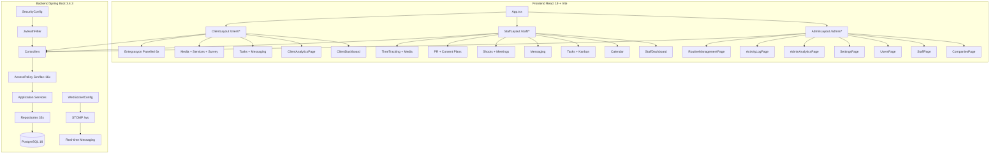

# FOG İstanbul Ajans CRM — Kapsamlı Teknik Mimari Raporu, Pazarlama Stratejisi ve Yasal Uyumluluk Metinleri

> **Hazırlayan:** DeepSeek V4 Pro — Kıdemli Yazılım Mimarisi Uzmanı, SaaS Ürün Yöneticisi, Dijital Reklam Hukuki Uyum Danışmanı
> **Rapor Tarihi:** Haziran 2026
> **Ürün:** FOG İstanbul Ajans CRM (SaaS, Multi-Tenancy)
> **Analiz Kapsamı:** 35 Flyway migration, 28 backend modülü, 20 frontend feature modülü, 36 JPA entity, 16 Access Policy sınıfı

---

## 📐 ADIM 1 — DERİN MODÜLER ANALİZ VE SİSTEM RAPORU

### 1. Sistem Mimarisi Özeti

| Katman | Teknoloji | Versiyon |
|--------|-----------|----------|
| Backend Framework | Spring Boot 3.4 | 3.4.3 |
| Java | OpenJDK | 17 LTS |
| ORM | Spring Data JPA (Hibernate) | 6.x |
| Veritabanı | PostgreSQL | 16 |
| Migration | Flyway | Core |
| Auth | Spring Security + JWT (jjwt) | 0.12.6 |
| WebSocket | Spring WebSocket + STOMP | 3.4.3 |
| Dosya Depolama | Cloudinary (bağımlılık var, şu anda local uploads) | — |
| Entegrasyonlar | Google Analytics Data API, Google Ads API, Meta Graph API, PageSpeed API, Google Search Console API | — |
| Frontend Framework | React + Vite | React 19, Vite 8-beta |
| State Management | TanStack React Query | v5 |
| Routing | React Router DOM | v7 |
| Stil | Tailwind CSS | v4 |
| Dil | TypeScript | 5.9 |
| WebSocket Client | SockJS + @stomp/stompjs | — |
| Grafikler | Recharts | v3 |
| Animasyon | Framer Motion | v12 |
| i18n | i18next + react-i18next | — |
| Deployment | Docker Compose (local) / Coolify (production) | — |

### 1.1 Kimlik Doğrulama Mimarisi (JWT + HttpOnly Cookie)

Sistem `SecurityConfig.java` üzerinden stateless JWT doğrulaması ile çalışır. Token'lar **HttpOnly cookie** olarak tarayıcıya yazılır; JavaScript erişimine kapalıdır (XSS koruması).

**Endpoint güvenlik matrisi:**

| URL Prefix | Yetki Seviyesi |
|-----------|----------------|
| `/api/auth/**` | Public (login, refresh, logout, me, csrf) |
| `/api/admin/**` | `hasRole('ADMIN')` |
| `/api/staff/**` | `hasAnyRole('ADMIN', 'AGENCY_STAFF')` |
| `/api/client/**` | `hasAnyRole('ADMIN', 'COMPANY_USER')` |
| `/ws` | WebSocket (SockJS + STOMP) |

**Token yapısı:**

```
Access Token:  30 dakika (cookie: access_token)
Refresh Token: 7 gün (cookie: refresh_token, DB'de SHA-256 hash)
```

**Frontend auth akışı (`AuthContext.tsx` + `api/client.ts` Axios interceptor):**

```
1. LoginPage → csrf() → POST /api/auth/login → Backend BCrypt doğrular
2. HttpOnly cookie'ye access_token + refresh_token yazılır
3. Frontend yalnızca UserInfo (id, email, fullName, globalRole, membershipRole, companyId) alır
4. 401 hatasında interceptor → POST /api/auth/refresh → yeni access_token → orijinal istek tekrarlanır
```

---

### 2. Panel #1 — Yönetici (Süper Admin) Modülü

**Global Role:** `ADMIN`
**Route:** `/admin/*`

Admin paneli, sistemin tüm tenant'larını ve kullanıcılarını tek elden yönetir. Herhangi bir şirket üyeliğine ihtiyaç duymaz; tüm `AccessPolicy` sınıfları ADMIN kullanıcısı için `FULL` erişim döndürür.

#### 2.1 Route / Sayfa Haritası

| Route | Sayfa | İşlev |
|-------|-------|-------|
| `/admin` | `Dashboard` | Sistem geneli metrikler (şirket sayısı, çalışan sayısı, görev istatistikleri) |
| `/admin/companies` | `CompaniesPage` | Tüm CLIENT kind şirketlerin listesi, yeni şirket oluşturma |
| `/admin/companies/:id` | `CompanyDetailPage` | Şirket bilgileri, üyeler, izinler, hizmet toggle, altyapı bilgileri |
| `/admin/staff` | `StaffPage` | Ajans çalışanı listesi, yeni çalışan ekleme |
| `/admin/staff/:id` | `StaffDetailPage` | Çalışan detayı, atandığı şirketler, izin yönetimi |
| `/admin/users` | `UsersPage` | Tüm kullanıcı profilleri yönetimi |
| `/admin/settings` | `SettingsPage` | Sistem genel ayarları |
| `/admin/analytics` | `AdminAnalyticsPage` | Admin özelinde analitik özet |
| `/admin/activity-log` | `ActivityLogPage` | Sistem geneli aktivite kayıtları |
| `/admin/routine` | `RoutineManagementPage` | Rutin görev tanımları yönetimi |

#### 2.2 Backend Servis Mimarisi

**Şirket Yönetimi (`CompanyController` → `CompanyService`):**

```java
// CompanyService.createCompanyWithOwner()
@Transactional
public CompanyResponse createCompanyWithOwner(CreateCompanyDTO dto) {
    // 1. Owner email daha önce kayıtlı mı? → ConflictException
    // 2. Company entity oluştur (kind=CLIENT)
    // 3. Person entity oluştur (CRM bilgileri)
    // 4. UserProfile oluştur (globalRole=COMPANY_USER, BCrypt password)
    // 5. CompanyMembership oluştur (membershipRole=OWNER)
    // 6. Varsayılan izinler ata (ALL_PERMISSION_KEYS → FULL)
    // 7. Şirket grup mesaj kanalı oluştur (GroupConversation)
    // 8. Seçilen hizmetler company_services tablosuna yazılır
    // Hata → tüm işlem rollback (@Transactional)
}
```

**Çalışan Atama (`StaffController` → `StaffService`):**

```java
// StaffService.assignToCompany()
// 1. Kullanıcı ve şirket varlığını kontrol et
// 2. CompanyMembership oluştur (membershipRole=AGENCY_STAFF)
// 3. Şirket grup kanalına ekle
// 4. İzin seviyelerini varsayılan ata
```

**Hizmet Toggle (`AdminCompanyServiceController` → `CompanyServicesManager`):**

```java
// CompanyServicesManager.toggleService(companyId, ServiceCategory, active)
// Admin panelinden şirketin hangi hizmet modüllerini göreceğini açar/kapatır
// Eski şirketlerde eksik hizmet satırı varsa otomatik oluşturur (geriye dönük uyum)
```

#### 2.3 Veri Akışı (Örnek: Yeni Şirket Oluşturma)

```
CompaniesPage (React)
  → adminApi.createCompany(data)
  → POST /api/admin/companies
  → CompanyController.create()
  → CompanyService.createCompanyWithOwner() [@Transactional]
    → CompanyRepository.save()
    → PersonRepository.save()
    → UserProfileRepository.save()
    → CompanyMembershipRepository.save()
    → CompanyPermissionRepository.saveAll()
    → GroupMessagingService.createCompanyGroup()
    → CompanyServicesManager.enableServices()
  → 201 Created + CompanyResponse DTO
  → React Query cache invalidate → CompaniesPage yeniden render
```

#### 2.4 Abonelik / Ödeme Takibi

Projenin mevcut durumunda `company_services` tablosu bir "satın alınan hizmetler" kaydı olarak işlev görür. `contractStatus` (ACTIVE/INACTIVE/PENDING) şirket seviyesinde kontrat durumunu tutar. Ayrı bir ödeme/fatura modülü henüz eklenmemiştir; `company_services` tablosu bu amaca genişletilebilir temel sağlar.

---

### 3. Panel #2 — Ajans Sahibi / Yönetimi Modülü (Staff Panel)

**Global Role:** `AGENCY_STAFF` (veya `ADMIN`)
**Route:** `/staff/*`

Bu panel, ajansın operasyonel kalbidir. Ajans çalışanları atandıkları şirketlerin görevlerini, mesajlarını, takvimini, çekimlerini ve PR projelerini yönetir.

#### 3.1 Route / Sayfa Haritası

| Route | Sayfa | İşlev |
|-------|-------|-------|
| `/staff` | `StaffDashboard` | Günlük görev listesi, memnuniyet oranı grafiği, mesaj özeti, yaklaşan görevler, notlar |
| `/staff/calendar` | `StaffCalendarPage` | Aylık takvim, görev/etkinlik noktaları, etkinlik detay popup |
| `/staff/tasks` | `TasksPage` | Tüm görevler, filtreleme (günlük/geciken/önemli), pagination |
| `/staff/kanban` | `KanbanPage` | Drag-drop Kanban board (45KB bileşen) |
| `/staff/companies` | `StaffCompaniesPage` | Atanan şirketlerin listesi |
| `/staff/companies/:id` | `StaffCompanyDetail` | Şirket detayı ve çalışanları |
| `/staff/completed` | `CompletedTasksPage` | Tamamlanan görevler, puanlama geçmişi |
| `/staff/pr` | `PrProjectsPage` | PR projeleri yönetimi (fazlar, ekip, notlar) |
| `/staff/shoots` | `ShootsPage` | Çekim planlaması (tarih, ekip, ekipman) |
| `/staff/messaging` | `MessagingPage` | Birebir DM + şirket grup mesajlaşması |
| `/staff/meetings` | `MeetingsPage` | Toplantı yönetimi |
| `/staff/notes` | `NotesPage` | Kişisel notlar |
| `/staff/content-plans` | `ContentPlansPage` | İçerik planı yönetimi |
| `/staff/analytics` | `StaffAnalyticsPage` | Çalışan özelinde analitik |
| `/staff/settings` | `SettingsPage` | Profil ayarları |
| `/staff/time-tracking` | `TimeTrackingPage` | Görev bazlı zaman takibi |
| `/staff/media` | `StaffMediaLibraryPage` | Şirket medya kütüphanesi |
| `/staff/requests` | `ApprovalRequests` | Onay bekleyen talepler |

#### 3.2 Görev Yönetimi Veri Modeli

```
Task
├── id (UUID)
├── company_id (FK → companies)
├── assignee_id (FK → user_profiles)
├── created_by (FK → user_profiles)
├── title, description
├── category (TASK, SHOOT, MEETING, CONTENT, PR, WEB_MAINTENANCE)
├── priority (LOW, MEDIUM, HIGH, URGENT)
├── status (PENDING, IN_PROGRESS, REVIEW, COMPLETED, CANCELLED)
├── due_date, completed_at
├── TaskReview (müşteri puanlaması)
└── TaskNote (görev notları)
```

**API Endpoint'leri:**

```
GET    /api/staff/tasks?companyId=&status=&priority=&page=
GET    /api/staff/tasks/my
GET    /api/staff/tasks/{id}
POST   /api/staff/tasks
PUT    /api/staff/tasks/{id}
DELETE /api/staff/tasks/{id}
GET    /api/staff/tasks/{taskId}/notes
POST   /api/staff/tasks/{taskId}/notes
DELETE /api/staff/tasks/notes/{noteId}
```

**Access Policy (`TaskAccessPolicy`):**
- ADMIN: tüm görevlere FULL erişim
- AGENCY_STAFF: yalnızca atandığı şirketlerin görevlerine erişim
- COMPANY_USER: yalnızca kendi şirketinin görevlerini görme + puanlama

#### 3.3 Kanban Board (`KanbanPage.tsx`, 45KB)

Drag-drop sıralama (`@dnd-kit`), task detay popup, hızlı durum değiştirme, görev kartında öncelik rengi, atanan kişi avatarı, son tarih göstergesi.

#### 3.4 Zaman Takibi (`TimeTrackingController`)

```
POST /api/staff/time-tracking/start?taskId=
POST /api/staff/time-tracking/stop?entryId=
GET  /api/staff/time-tracking/entries?startDate=&endDate=
GET  /api/staff/time-tracking/summary?companyId=
```

Her görev için başlat/durdur mekanizması. Faturalandırma ve verimlilik raporlaması için temel veri sağlar.

#### 3.5 Finansal Yönetim ve Kota

Mevcut durumda finansal yönetim, `company_services` hizmet aktiflik durumu ve `contractStatus` alanı üzerinden izlenir. Ayrı bir fatura/bütçe modülü için veri altyapısı mevcuttur; `companies` tablosundaki `contractStatus` ve `company_services` ilişkisi bu amaca hizmet edecek şekilde genişletilebilir. Kota sistemi için `CompanyPermission` tablosundaki `RESTRICTED` seviyesi mevcuttur — bu seviyede işlem onaya tabidir.

---

### 4. Panel #3 — Çalışan (Ajans Personeli) Operasyonel Modülü

Staff panelinde detaylandırılan tüm operasyonel iş akışları ajans personeline aittir. Ek olarak aşağıdaki modüller ajans çalışanının günlük operasyonlarını yönetir:

**Floating Action Button (`FloatingTaskFab`):**
- Sağ alt "+" butonu → Görev oluştur, Mesaj gönder, Çekim planla, Toplantı ayarla, PR projesi başlat
- Her action için tam işlevsel dialog formları + validasyon + şirket/atayan seçimi

**Bildirim Sistemi (`NotificationService` + `NotificationBell`):**
- WebSocket üzerinden real-time bildirim
- 17+ bildirim tipi (görev atandı, mesaj geldi, onay talebi, çekim planlandı, vs.)
- Okundu/okunmadı durumu, toplu okundu işaretleme

**Global Arama (`GlobalSearch.tsx` + `SearchController`):**
- Şirket, görev, kullanıcı, not, mesaj genelinde tam metin arama

---

### 5. Panel #4 — Müşteri Portalı Modülü (Client Panel)

**Global Role:** `COMPANY_USER`
**Route:** `/client/*`

Müşteri portalı, ajansın hizmet verdiği markaların/şirketlerin kendi panelleridir. **En kritik mimari özellik: Şirket Hizmetleri Sistemi (Company Services).** Her müşteri aynı panel yapısına sahiptir; ancak panelde görünen modüller, admin tarafından o şirket için aktifleştirilen hizmet kategorilerine göre dinamik olarak belirlenir.

#### 5.1 Şirket Hizmetleri Sistemi (Company Services Architecture)

**Amaç:** "Her müşteriye ayrı panel yapmak yerine, tek client panelini şirketin aldığı hizmetlere göre şekillendirmek."

```
company_services tablosu:
  company_id → companies.id
  service_category → ServiceCategory enum
  active → boolean
```

**ServiceCategory Enum Değerleri ve Açtığı Modüller:**

| Enum | Açtığı Client Modülleri | API Guard Endpoint Örnekleri |
|------|------------------------|------------------------------|
| `DIGITAL_MARKETING` | Google Analytics, Search Console | `/api/client/analytics/ga/**`, `/api/client/analytics/sc/**` |
| `WEB_DESIGN` | PageSpeed, Site Altyapı Verileri | `/api/client/pagespeed/**` |
| `AD_MANAGEMENT` | Google Ads, Meta Ads | `/api/client/analytics/google-ads/**`, `/api/client/analytics/meta-ads/**` |
| `SOCIAL_MEDIA` | Instagram Analiz, Reels, Gönderiler | `/api/client/analytics/ig/**` |
| `PRODUCTION` | Çekim Takvimi | `/api/client/shoots/**` |
| `CONTENT_MARKETING` | İçerik Planı, Onay Akışları | `/api/client/content-plans/**` |

**Çift Katmanlı Güvenlik:**

```
Frontend (UI Gate)                    Backend (Access Guard)
     │                                       │
ServicePageGate                         CompanyServiceAccessGuard
  hasService() kontrolü                  .requireService(userId, companyId, serviceCategory)
  → Menüde gizle/göster                 → 1. ADMIN/AGENCY_STAFF: geçiş
  → Rota kilitle                        → 2. COMPANY_USER: üyelik kontrolü
  → ServiceBlurOverlay                  → 3. company_services.active kontrolü
                                        → 4. Aktif değilse: 403 Forbidden
```

#### 5.2 Route / Sayfa Haritası

| Route | Sayfa | Görünürlük Koşulu | İşlev |
|-------|-------|-------------------|-------|
| `/client` | `ClientDashboard` | Her zaman | Hoş geldin ekranı, özet metrikler |
| `/client/analytics` | `ClientAnalyticsPage` | Her zaman (paneller hizmete göre) | Tüm aktif hizmetlerin toplu rapor sayfası |
| `/client/google-analytics` | `GoogleAnalyticsDetailPage` | DIGITAL_MARKETING aktif | GA4 verileri: kullanıcı, oturum, dönüşüm, sayfa görüntüleme |
| `/client/search-console` | `SearchConsoleDetailPage` | DIGITAL_MARKETING aktif | Arama sorguları, tıklama, gösterim, CTR, konum |
| `/client/instagram` | `InstagramDetailPage` | SOCIAL_MEDIA aktif | Takipçi, etkileşim, büyüme, Reels performansı |
| `/client/instagram/reels` | `InstagramReelsPage` | SOCIAL_MEDIA aktif | Son 30 gün Reels detayları |
| `/client/instagram/posts` | `InstagramPostsPage` | SOCIAL_MEDIA aktif | Son gönderi performansı |
| `/client/web-design` | `PageSpeedDetailPage` | WEB_DESIGN aktif | Mobil/masaüstü performans skoru, site altyapı verileri |
| `/client/google-ads` | `GoogleAdsDetailPage` | AD_MANAGEMENT aktif | Kampanya performansı, tıklama, dönüşüm, maliyet |
| `/client/meta-ads` | `MetaAdsDetailPage` | AD_MANAGEMENT aktif | Meta kampanya metrikleri |
| `/client/shoots` | `ClientShootsPage` | PRODUCTION aktif | Planlanan çekimler (tarih, ekip, lokasyon) |
| `/client/content-plans` | `ClientContentPlanPage` | CONTENT_MARKETING aktif | İçerik planı görüntüleme, onay/revizyon |
| `/client/tasks` | `ClientTasksPage` | Her zaman | Görev listesi + tamamlananlar + puanlama |
| `/client/media` | `MediaLibraryPage` | Her zaman | Paylaşılan medya dosyaları |
| `/client/messaging` | `ClientMessagingPage` | Her zaman | Ajans çalışanlarıyla mesajlaşma |
| `/client/team` | `ClientTeamPage` | OWNER only | Şirket çalışanlarını yönetme |
| `/client/services` | `ServicesPage` | OWNER only | Ek hizmet talep formu |
| `/client/surveys` | `SurveyPage` | OWNER only | Memnuniyet anketi |
| `/client/onboarding` | `OnboardingPage` | OWNER only | Müşteri alıştırma süreci |
| `/client/settings` | `ClientSettingsPage` | Her zaman | Profil ayarları |

#### 5.3 Onay ve Revizyon Mekanizması

Müşteri portalındaki **en kritik iş akışı**, "Tek Tıkla Onay/Revizyon" mekanizmasıdır:

```
İçerik Planı Onay Akışı:
  Ajans çalışanı içerik planı oluşturur
    → ContentPlan entity (status: PENDING_APPROVAL)
    → Müşteri ClientContentPlanPage'te görür
      → ✅ "Onayla" → status: APPROVED
      → 🔄 "Revizyon İste" → ApprovalRequest oluşturulur → ajansa bildirim

Görev Puanlama:
  Görev tamamlandı (status: COMPLETED)
    → Müşteri ClientTasksPage'te görür
      → 1-5 yıldız puanlama → TaskReview oluşturulur
      → Yorum eklenebilir
```

**Restricted izin akışı (`PermissionLevel.RESTRICTED`):**
- Kullanıcı işlem yapar → `ApprovalRequest` entity oluşturulur
- Şirket sahibine bildirim gider
- Sahip onaylarsa → işlem tamamlanır
- Sahip reddederse → işlem iptal, kullanıcıya bildirim

#### 5.4 Faturalar ve Finansal Şeffaflık

Müşteri portalında fatura görüntüleme için `company_services` tablosu ve `contractStatus` alanı temel sağlar. Mevcut frontend `ServicesPage` sayfası "Ek Hizmet Al" formu sunar. Finansal görünürlük için önerilen genişletme: `invoices` tablosu, `payments` tablosu ve `ClientBillingPage` sayfası.

---

### 6. Mesajlaşma Mimarisi

Sistem iki katmanlı mesajlaşma mimarisine sahiptir:

#### 6.1 Birebir Mesajlaşma (DM)

**Entity'ler:** `Conversation`, `Message`, `MessageRead`

```
Conversation
├── participant1 (user_profiles FK)
├── participant2 (user_profiles FK)
├── company_id (ortak şirket)
├── created_at, updated_at
└── Message[]
    ├── sender_id
    ├── content
    ├── is_read
    └── created_at
```

**Akış:**
```
startConversation(targetUserId)
  → Ortak şirket kontrolü
  → Mevcut conversation varsa döner, yoksa yeni oluşturur

POST /conversations/{id}/messages
  → Katılımcı mı? kontrolü
  → Message kaydet
  → WebSocket broadcast: /topic/thread/{conversationId}
  → Alıcıya bildirim: /topic/user/{userId}
```

#### 6.2 Grup Mesajlaşma

**Entity'ler:** `GroupConversation`, `GroupMember`, `GroupMessage`, `GroupMessageRead`

```
GroupConversation
├── company_id (otomatik oluşturulur)
├── name
├── created_by
└── GroupMember[]
    ├── user_id
    └── joined_at
```

**Otomatik Grup Oluşturma:**
```
CompanyService.createCompanyWithOwner()
  → GroupMessagingService.createCompanyGroup(company, owner)
  → CompanyService.addEmployeeToCompany()
    → GroupMessagingService.addMemberToCompanyGroup()
```

**WebSocket Topic'leri:**

| Destination | İşlev |
|-------------|-------|
| `/topic/thread/{conversationId}` | DM mesaj broadcast |
| `/topic/group/{groupId}` | Grup mesaj broadcast |
| `/topic/user/{userId}` | Kişisel bildirim |
| `/topic/read/{conversationId}` | Okundu bilgisi broadcast |
| `/user/{userId}/queue/notifications` | Kişisel kuyruk |

---

### 7. Entegrasyon Mimarisi (6 Dış Entegrasyon)

CRM, 6 ayrı dış entegrasyon modülüne sahiptir. Tüm entegrasyonlar `CompanyServiceAccessGuard` ile korunur ve Google OAuth 2.0 veya Facebook Graph API OAuth üzerinden kimlik doğrulaması kullanır.

#### 7.1 Google Analytics (GA4)

```
GoogleAnalyticsController
  → CompanyServiceAccessGuard(DIGITAL_MARKETING)
  → GoogleAnalyticsService
    → GoogleOAuthTokenRepository (token yönetimi)
    → Google Analytics Data API (GA4)

Endpointler:
  GET  /api/client/analytics/ga/status
  GET  /api/client/analytics/ga/overview
  POST /api/client/analytics/ga/property
  DELETE /api/client/analytics/ga/disconnect
```

#### 7.2 Google Search Console

```
SearchConsoleController
  → CompanyServiceAccessGuard(DIGITAL_MARKETING)
  → SearchConsoleService
    → GoogleOAuthTokenRepository
    → Google Search Console API

Endpointler:
  GET  /api/client/analytics/sc/status
  GET  /api/client/analytics/sc/sites
  GET  /api/client/analytics/sc/overview
  POST /api/client/analytics/sc/site-url
```

#### 7.3 Google Ads

```
GoogleAdsController
  → CompanyServiceAccessGuard(AD_MANAGEMENT)
  → GoogleAdsService
    → GoogleOAuthTokenRepository
    → Google Ads API

Endpointler:
  GET  /api/client/analytics/google-ads/status
  GET  /api/client/analytics/google-ads/overview
  POST /api/client/analytics/google-ads/customer-id
  DELETE /api/client/analytics/google-ads/disconnect
```

#### 7.4 Meta Ads

```
MetaAdsController
  → CompanyServiceAccessGuard(AD_MANAGEMENT)
  → MetaAdsService
    → InstagramOAuthService (Meta Graph API token)
    → Meta Ads API

Endpointler:
  GET  /api/client/analytics/meta-ads/status
  GET  /api/client/analytics/meta-ads/overview
  POST /api/client/analytics/meta-ads/ad-account
  DELETE /api/client/analytics/meta-ads/disconnect
```

#### 7.5 Instagram

```
InstagramController
  → CompanyServiceAccessGuard(SOCIAL_MEDIA)
  → InstagramService
    → InstagramOAuthService (Instagram Graph API)
    → Instagram Graph API

Endpointler:
  GET  /api/client/analytics/ig/status
  GET  /api/client/analytics/ig/overview
  GET  /api/client/analytics/ig/reels
  GET  /api/client/analytics/ig/posts
  DELETE /api/client/analytics/ig/disconnect
```

#### 7.6 PageSpeed / Web Design

```
PageSpeedController
  → CompanyServiceAccessGuard(WEB_DESIGN)
  → PageSpeedService
    → Google PageSpeed Insights API

Endpointler:
  GET /api/client/pagespeed
  PUT /api/client/pagespeed/website
  GET /api/staff/companies/{companyId}/pagespeed
```

---

### 8. Veritabanı Scheması (Özet)

Proje **35 Flyway migration** ile yönetilir. `spring.jpa.hibernate.ddl-auto: validate` ile çalışır — Hibernate şema oluşturmaz, yalnızca doğrular.

| Migration | İçerik |
|-----------|--------|
| V1 | Tüm çekirdek tablolar (companies, persons, user_profiles, memberships, permissions, tasks, meetings, shoots, PR projects, content plans, approval requests, messages, company_services) |
| V2-V8 | İndeksler, yeni alanlar, rutin görevler |
| V9-V12 | Google OAuth, Instagram token, şirket altyapı alanları |
| V13-V18 | Birebir mesaj (conversations, messages), okundu bilgisi, grup mesajlaşma |
| V19-V25 | Rutin görevler, görev yükseltmeleri, Search Console, Google Ads |
| V26-V35 | Meta Ads, Web Tasarım, Çekim ekipmanı, Grup okundu bilgisi, seed data |

**36 JPA Entity + 17 Enum Tipi kullanılmaktadır.**

---

### 9. Frontend Mimari Katmanları

```
frontend/src/
├── api/            → Axios instance + API fonksiyonları (auth, admin, staff, clientPanel, features)
├── app/            → App.tsx + routes/ (adminRoutes, staffRoutes, clientRoutes)
├── components/     → Paylaşılan UI (ProtectedRoute, FloatingTaskFab, GlobalSearch, NotificationBell, ThemeToggle, LanguageSwitcher, ServiceUpsellOverlay, UserAvatar, SettingsPage)
├── features/       → 20 feature modülü (her biri api/, hooks/, ui/, model/)
├── hooks/          → Shared hooks (useActiveServices, useNotifications, useUnreadCount, useClientDataPrefetch)
├── i18n/           → Çoklu dil desteği (tr.json, en.json)
├── layouts/        → AdminLayout, StaffLayout, ClientLayout
├── lib/            → API hata yönetimi
├── pages/          → Sayfa bileşenleri (admin/, client/, staff/, auth/)
├── store/          → Global state (AuthContext, ThemeContext)
```

---



---

## 🎯 ADIM 2 — B2B MÜŞTERİ KAZANIMI ODAKLI LANDING PAGE STRATEJİSİ

### "Müşterileri Bu Projede Hangi Özellikler Çeker?"

Bu CRM sistemini kullanan ajansların, kendi müşterilerini (markaları/şirketleri) sisteme çekebilmesi için bir Landing Page (Açılış Sayfası) stratejisi aşağıda sunulmuştur.

---

### 1. Şeffaflık ve Güven: Müşteri Portalının Cazibe Gücü

**Problem:** Geleneksel ajans-müşteri ilişkisinde marka, ajansın ne üzerinde çalıştığını e-posta zincirlerinden, WhatsApp gruplarından veya haftalık toplantılardan öğrenir. Süreç opaktır.

**Çözüm — FOG İstanbul Müşteri Portalı:**
- Müşteri, **kendine özel gerçek zamanlı panel** üzerinden tüm iş süreçlerini anlık izler
- Görev durumları: "Bekliyor → Devam Ediyor → İncelemede → Tamamlandı" zinciri canlı takip edilir
- İçerik onayları: "Tek Tıkla Onayla / Revizyon İste" ile e-posta trafiği sıfırlanır
- Çekim takvimi: Hangi tarihte, nerede, kiminle çekim yapılacağı önceden görünür
- Ajans çalışanlarıyla **doğrudan mesajlaşma** ile WhatsApp karmaşası sona erer

**Landing Page'de Nasıl Pazarlanmalı:**

> **"Ajansınızın Çalışmalarını Canlı İzleyin."**
> FOG İstanbul Müşteri Portalı ile tüm pazarlama, reklam ve prodüksiyon süreçlerinizi **tek panelden, şeffaf ve anlık** takip edin. Artık "ne durumda?" diye sormak yok — cevap panelinizde.

---

### 2. Onay ve Revizyon Hızı: "Tek Tıkla Onay" Mekanizması

**Problem:** İçerik onay süreçlerinde e-posta zincirleri, "şu PDF'i inceleyip dönüş yapalım" toplantıları, kaybolan revizyon talepleri.

**Çözüm — CRM Onay Akışı:**
- Ajans içerik planını sisteme girer
- Müşteri anında bildirim alır
- Panel üzerinden **✅ Onayla** veya **🔄 Revizyon İste** butonu ile tek tıkla işlem
- Revizyon talebi doğrudan ilgili ajans çalışanına bildirim olarak gider
- Tüm onay geçmişi kayıt altında

**Landing Page'de Nasıl Pazarlanmalı:**

> **"Onay Beklemek Yok, Tek Tıkla İlerle."**
> İçerikleri onaylamak için e-posta beklemeyin. FOG panelinizden **tek tıkla onaylayın**, revizyon isterseniz açıklamanızı yazın, anında ajansınıza iletilsin. Süreç hızınız 3 kat artsın.

---

### 3. Finansal Netlik: Bütçe ve Harcama Şeffaflığı

**Problem:** Kurumsal müşteriler için en kritik konu, ajansa ödedikleri ücretin karşılığını net görememektir. "Bu ay ne yapıldı?" sorusu sürekli gündemdedir.

**Çözüm — Müşteri Panelinde Finansal Görünürlük:**
- Aktif hizmet paketleri ve kapsamları panelde listelenir
- Tamamlanan görevlerin zaman çizelgesi, yapılan işin somut kanıtıdır
- Gelecek dönem için **Ek Hizmet Al** seçeneği ile upsell doğal akışta gerçekleşir
- Tüm yapılan işlerin kaydı, dönemsel rapor olarak export edilebilir

**Landing Page'de Nasıl Pazarlanmalı:**

> **"Yatırımınızın Karşılığını Net Görün."**
> Hangi görev tamamlandı, kaç içerik yayınlandı, reklam kampanyalarınızın performansı ne durumda? FOG panelinizde **tüm metrikler şeffaf**. Bütçenizin nereye gittiğini her ay rapor bekleyerek değil, panelinizden anlık görerek yönetin.

---

### 4. Landing Page Sayfa Yapısı (Yukarıdan Aşağıya)

#### Section 1: Hero Section

```
┌──────────────────────────────────────────────────────────┐
│  [FOG İstanbul Logo]                           [Giriş Yap]│
├──────────────────────────────────────────────────────────┤
│                                                            │
│   "Ajansınızla Tek Panelde Çalışın."                      │
│   Tüm pazarlama süreçlerinizi şeffaf, hızlı ve            │
│   ölçülebilir yönetmek için FOG İstanbul Müşteri          │
│   Portalı'na davetlisiniz.                                │
│                                                            │
│   [Hemen Keşfedin →]    [Mevcut Müşteriyseniz Giriş Yap]  │
│                                                            │
│   [Dashboard Önizleme Mockup Görseli]                      │
└──────────────────────────────────────────────────────────┘
```

**Başlık Alternatifleri:**
- "Ajansınızla Tek Panelde Çalışın."
- "Pazarlama Süreçlerinizi Canlı Yönetin."
- "Şeffaf Ajans, Ölçülebilir Büyüme."

**Alt Başlık:**
"FOG İstanbul Müşteri Portalı ile reklam kampanyalarınızı, sosyal medya performansınızı, içerik onaylarınızı ve web site sağlığınızı tek ekrandan takip edin."

---

#### Section 2: Nasıl Çalışır? (3 Adım)

```
┌─────────────────┐  ┌─────────────────┐  ┌─────────────────┐
│      ①          │  │      ②          │  │      ③          │
│  Davet Alın     │→│  Giriş Yapın     │→│  Yönetmeye      │
│                 │  │                 │  │  Başlayın       │
│ Ajansınız size  │  │ E-posta ve      │  │ Görevleri       │
│ özel bir        │  │ şifrenizle      │  │ takip edin,     │
│ müşteri         │  │ paneline güvenli│  │ içerikleri      │
│ hesabı oluşturur│  │ giriş yapın     │  │ onaylayın,      │
│                 │  │                 │  │ raporları       │
│                 │  │                 │  │ görüntüleyin    │
└─────────────────┘  └─────────────────┘  └─────────────────┘
```

---

#### Section 3: Özellikler (Features Grid)

**3.1 Raporlar ve Analitik (Dijital Pazarlama Modülü)**
- Google Analytics entegrasyonu: Ziyaretçi, oturum, dönüşüm verileri
- Google Search Console: Arama performansı, tıklama, gösterim, sıralama
- Sayfa Hızı (PageSpeed): Mobil ve masaüstü performans skorları

> **Pazarlama Metni:** "Dijital varlığınızın nabzını tutun. Google Analytics ve Search Console verilerinizi ajansınızın yorumuyla birlikte tek panelde görün."

**3.2 Reklam Yönetimi (Google Ads + Meta Ads Modülü)**
- Google Ads kampanya metrikleri: Tıklama, dönüşüm, ROAS, maliyet
- Meta Ads (Facebook/Instagram): Kampanya ve reklam seti performansı
- Bütçe takibi ve optimizasyon önerileri

> **Pazarlama Metni:** "Reklam bütçenizin nereye gittiğini bilin. Her bir kampanyanın performansını, maliyetini ve geri dönüşünü şeffafça görün."

**3.3 Sosyal Medya Takibi (Instagram Modülü)**
- Takipçi büyüme grafiği (günlük, haftalık, aylık)
- Etkileşim oranları, gelen/giden takipçi
- Son Reels ve gönderi performansı: İzlenme, beğeni, yorum

> **Pazarlama Metni:** "Instagram hesabınızın büyümesini verilerle izleyin. Hangi içerik ne kadar etkileşim aldı, takipçi kitleniz nasıl değişiyor — hepsi panelinizde."

**3.4 İçerik Onay ve Planlama**
- İçerik takvimi: Hangi platformda, ne zaman, hangi içerik yayınlanacak
- Tek tıkla onay / revizyon talebi
- Onay geçmişi ve versiyon takibi

> **Pazarlama Metni:** "İçerik onay süreçlerinizi e-posta zincirinden kurtarın. Panel üzerinden anında onaylayın veya revizyon talebi iletin."

**3.5 Görev Yönetimi ve İlerleme Takibi**
- Görev durumları canlı takip: Bekliyor → Devam Ediyor → Tamamlandı
- Tamamlanan işlerin zaman çizelgesi
- Görev puanlama: Yapılan işi değerlendirin

> **Pazarlama Metni:** "Ajansınızın sizin için neler yaptığını anlık görün. Her görevin durumunu, tamamlanma tarihini ve detayını takip edin."

**3.6 Çekim ve Prodüksiyon Takvimi**
- Planlanan çekimler: Tarih, lokasyon, ekip bilgisi
- Ekipman listesi ve gereksinimler
- Çekim öncesi/sonrası notlar

> **Pazarlama Metni:** "Prodüksiyon süreçlerinizde sürpriz olmasın. Çekim takviminizi önceden görün, hazırlıklarınızı yapın."

**3.7 Doğrudan Mesajlaşma**
- Ajans ekibinizle panel içi mesajlaşma
- WhatsApp ve e-posta karmaşasına son
- Dosya paylaşımı ve medya kütüphanesi
- Okundu bilgisi ve anlık bildirimler

> **Pazarlama Metni:** "Tüm iletişiminiz tek kanalda. Ajans ekibinizle panel üzerinden mesajlaşın, dosya paylaşın, onay verin."

---

#### Section 4: Sosyal Kanıt (Social Proof / Case Studies)

```
┌──────────────────────────────────────────────────────────┐
│  "FOG İstanbul ile Çalışan 50+ Marka Tek Panelde"       │
│                                                            │
│  [Logo 1]  [Logo 2]  [Logo 3]  [Logo 4]  [Logo 5]        │
│  [Logo 6]  [Logo 7]  [Logo 8]  [Logo 9]  [Logo 10]       │
│                                                            │
│  ┌────────────────────────────────────────────────────┐  │
│  │ 💬 "Eskiden her içerik onayı için 5 e-posta        │  │
│  │    gidiyordu. Şimdi panelden tek tıkla onaylıyorum, │  │
│  │    haftada minimum 3 saat kazanıyorum."             │  │
│  │    — [Pazarlama Müdürü, X Şirketi]                 │  │
│  └────────────────────────────────────────────────────┘  │
│  ┌────────────────────────────────────────────────────┐  │
│  │ 💬 "Reklam bütçemizin performansını anlık           │  │
│  │    görebilmek, kararlarımızı çok hızlandırdı.       │  │
│  │    Artık aylık rapor beklemiyoruz."                 │  │
│  │    — [CEO, Y Şirketi]                             │  │
│  └────────────────────────────────────────────────────┘  │
└──────────────────────────────────────────────────────────┘
```

---

#### Section 5: Sıkça Sorulan Sorular (FAQ)

```
S: Bu panel için ek ücret ödeyecek miyim?
C: Hayır. Müşteri portalı, FOG İstanbul ile çalışan tüm markalara ücretsiz sunulur.

S: Verilerim güvende mi?
C: Tüm verileriniz SSL şifreleme ile korunur. Google ve Meta entegrasyonları resmi OAuth 2.0 ile yapılır,
   şifreleriniz hiçbir şekilde saklanmaz. GDPR ve KVKK uyumludur.

S: Mobil cihazlardan erişebilir miyim?
C: Evet. FOG Müşteri Portalı responsive tasarıma sahiptir; telefon, tablet ve masaüstünden erişebilirsiniz.

S: Birden fazla çalışanım panelle erişebilir mi?
C: Evet. Şirket sahibi olarak çalışanlarınıza farklı yetki seviyelerinde erişim tanımlayabilirsiniz.

S: Panelde hangi verileri görebilirim?
C: Aktif hizmet paketinize bağlı olarak Google Analytics, Search Console, Google Ads, Meta Ads, Instagram
   analizleri, PageSpeed, içerik planları, çekim takvimi ve görevlerinizi görebilirsiniz.
```

---

#### Section 6: CTA (Call to Action)

```
┌──────────────────────────────────────────────────────────┐
│                                                            │
│         "İş Süreçlerinizi Şeffaf Yönetmeye                │
│          Hemen Başlayın."                                  │
│                                                            │
│   FOG İstanbul müşterisiyseniz, size özel panelinize      │
│   hemen giriş yapın. Değilseniz, bize ulaşın.             │
│                                                            │
│   [Panele Giriş Yap →]    [Bize Ulaşın →]                 │
│                                                            │
└──────────────────────────────────────────────────────────┘
```

---

#### Section 7: Footer

```
┌──────────────────────────────────────────────────────────┐
│  [FOG İstanbul Logo]                                      │
│  © 2026 FOG İstanbul Dijital Ajans. Tüm hakları saklıdır.│
│                                                            │
│  Hızlı Bağlantılar:  Gizlilik Politikası | Kullanım       │
│  Şartları | Çerez Politikası | Veri İşleme Sözleşmesi     │
│  | Bize Ulaşın                                            │
│                                                            │
│  İletişim: info@fogistanbul.com | +90 212 000 00 00       │
│  Adres: [Fiziksel Adres]                                  │
└──────────────────────────────────────────────────────────┘
```

---

## ⚖️ ADIM 3 — GOOGLE & META REKLAM UYUMLULUK METİNLERİ (LEGAL PAGES)

Aşağıdaki metinler, **FOG İstanbul** platformunun Google Ads, Meta Ads (Facebook/Instagram), Google Analytics, Google Tag Manager ve Meta Pixel entegrasyonlarını kullanan bir SaaS platformu olarak, GDPR (EU 2016/679) ve KVKK (6698 sayılı kanun) uyumlu şekilde hazırlanmıştır.

---

### 1. GİZLİLİK POLİTİKASI (PRIVACY POLICY)

**Son Güncelleme:** Haziran 2026

Bu Gizlilik Politikası, FOG İstanbul ("Platform Sahibi", "Biz") tarafından işletilen ve `[www.fogistanbul.com]` alan adı altında hizmet veren FOG İstanbul Ajans CRM platformunun ("Platform"), kullanıcılarından ("Kullanıcı", "Siz") topladığı kişisel verilerin işlenmesine ilişkin esasları belirler.

#### 1.1 Veri Sorumlusu

| Unsur | Bilgi |
|-------|-------|
| Veri Sorumlusu Unvanı | FOG İstanbul Dijital Ajans |
| Adres | `[Fiziksel Adres]` |
| E-posta | `info@fogistanbul.com` |
| Telefon | `+90 212 000 00 00` |
| Web Sitesi | `[www.fogistanbul.com]` |

#### 1.2 Toplanan Kişisel Veriler

Platformumuz aracılığıyla aşağıdaki kişisel veri kategorileri toplanmaktadır:

| Veri Kategorisi | Toplanan Veriler | Toplanma Yöntemi |
|-----------------|------------------|------------------|
| Kimlik Bilgileri | Ad, soyad | Kayıt formu (Admin tarafından manuel oluşturma) |
| İletişim Bilgileri | E-posta adresi, telefon numarası | Kayıt formu, kullanıcı profili güncelleme |
| Mesleki Bilgiler | Şirket unvanı, pozisyon, departman | CRM kişi kaydı oluşturma |
| İşlem Verileri | Görev durumu, mesaj içerikleri, onay/revizyon kayıtları, dosya yüklemeleri, zaman takip kayıtları, görev puanlamaları | Platform kullanımı sırasında otomatik |
| Entegrasyon Verileri | Google Analytics mülk ID'leri, Google Ads müşteri ID'leri, Meta reklam hesabı ID'leri, Instagram hesap bilgileri, Search Console site URL'leri | OAuth entegrasyon kurulumu sırasında kullanıcı onayı ile |
| Teknik Veriler | IP adresi, tarayıcı tipi ve versiyonu, işletim sistemi, cihaz bilgileri, sayfa görüntüleme süreleri, tıklama akışları | Çerezler ve günlük kayıtları aracılığıyla otomatik |
| Çerez Verileri | Oturum çerezleri, tercih çerezleri, analitik çerezler, pazarlama çerezleri | Tarayıcı çerezleri |

#### 1.3 Verilerin İşlenme Amaçları

Toplanan kişisel veriler aşağıdaki amaçlarla işlenmektedir:

1. **Hizmet Sunumu:** Platforma erişim sağlanması, kullanıcı hesabının yönetimi, görev ve proje takibi, mesajlaşma hizmetlerinin yürütülmesi, içerik onay akışlarının işletilmesi.
2. **Entegrasyon Yönetimi:** Google Analytics, Google Search Console, Google Ads, Meta Ads ve Instagram hesaplarının OAuth 2.0 ile bağlanması, bu hesaplardan analitik verilerin çekilmesi ve kullanıcıya raporlanması.
3. **Müşteri İlişkileri Yönetimi:** Ajans ile müşteri arasındaki iş akışının yönetilmesi, iletişim geçmişinin kaydı, memnuniyet anketlerinin iletilmesi.
4. **Analiz ve İyileştirme:** Platform kullanım istatistiklerinin analizi, hizmet kalitesinin artırılması, performans optimizasyonu.
5. **Yasal Yükümlülükler:** Yürürlükteki mevzuat gereği saklanması zorunlu kayıtların tutulması, yetkili makamlara bilgi verilmesi.
6. **Pazarlama ve Remarketing (Onay Halinde):** Google Ads ve Meta Ads remarketing kampanyaları, hedef kitle oluşturma, dönüşüm takibi.

**Hukuki Sebepler:**
- Sözleşmenin ifası (GDPR Art. 6/1-b, KVKK 5/2-c): Platform hizmetinin sunulması
- Meşru menfaat (GDPR Art. 6/1-f, KVKK 5/2-f): Platform iyileştirme, analiz
- Açık rıza (GDPR Art. 6/1-a, KVKK 5/1): Pazarlama ve remarketing çerezleri, üçüncü taraf veri paylaşımı
- Hukuki yükümlülük (GDPR Art. 6/1-c, KVKK 5/2-ç, 5/2-e): Yasal saklama yükümlülükleri

#### 1.4 Üçüncü Taraf Veri Paylaşımı ve Entegrasyonlar

Platformumuz, hizmet sunumu kapsamında aşağıdaki üçüncü taraf hizmet sağlayıcılarla veri paylaşmaktadır. Her bir entegrasyon için veri akışı ve amaç detaylı şekilde aşağıda açıklanmıştır.

##### 1.4.1 Google Analytics (GA4)

- **Sağlayıcı:** Google LLC (1600 Amphitheatre Parkway, Mountain View, CA 94043, ABD)
- **İşlenen Veriler:** IP adresi (anonimleştirilmiş), cihaz bilgileri, tarayıcı bilgileri, sayfa etkileşimleri, oturum verileri, dönüşüm olayları
- **Amaç:** Platform kullanım analizi, kullanıcı davranışı raporlama, hizmet iyileştirme
- **Hukuki Dayanak:** Açık rıza (çerez onayı)
- **Veri Aktarımı:** ABD'ye veri aktarımı, Google'ın EU Standart Sözleşme Maddeleri (SCC) kapsamında gerçekleşir
- **Google'ın Veri İşleme Şartları:** https://business.safety.google/adsprocessorterms/
- **Opt-out:** https://tools.google.com/dlpage/gaoptout

##### 1.4.2 Google Tag Manager

- **Sağlayıcı:** Google LLC
- **İşlenen Veriler:** Tag yönetimi için gerekli teknik veriler; Google Tag Manager kendisi kişisel veri toplamaz, diğer etiketlerin (Google Analytics, Meta Pixel vb.) yüklenmesini yönetir
- **Amaç:** Web sitesi etiketlerinin yönetimi
- **Hukuki Dayanak:** Meşru menfaat (teknik gereklilik)

##### 1.4.3 Meta Pixel (Facebook/Instagram)

- **Sağlayıcı:** Meta Platforms Ireland Ltd. (4 Grand Canal Square, Grand Canal Harbour, Dublin 2, İrlanda)
- **İşlenen Veriler:** Sayfa görüntüleme, buton tıklamaları, form gönderimleri, dönüşüm olayları, HTTP başlık bilgileri (IP adresi, tarayıcı bilgileri dahil), Meta kullanıcı ID'si (Meta hesabına giriş yapmış kullanıcılar için)
- **Amaç:** Dönüşüm takibi, remarketing/retargeting, özel hedef kitle oluşturma, reklam performans ölçümü
- **Hukuki Dayanak:** Açık rıza (çerez onayı)
- **Veri Aktarımı:** AB ve ABD arasındaki veri aktarımı, AB-ABD Veri Gizliliği Çerçevesi (Data Privacy Framework) veya Standart Sözleşme Maddeleri kapsamındadır
- **Meta'nın Veri İşleme Şartları:** https://www.facebook.com/legal/terms/dataprocessing
- **Facebook İşletme Araçları Şartları:** https://www.facebook.com/legal/technology_terms
- **Opt-out:** Facebook reklam tercihleri: https://www.facebook.com/adpreferences

##### 1.4.4 Google Ads

- **Sağlayıcı:** Google LLC
- **İşlenen Veriler:** Reklam kampanyası verileri, dönüşüm verileri, tıklama verileri, reklam etkileşimleri
- **Amaç:** Reklam kampanyası performans raporlaması, remarketing, dönüşüm takibi
- **Hukuki Dayanak:** Açık rıza (pazarlama çerezleri)
- **Veri Aktarımı:** Google'ın AB-ABD Veri Gizliliği Çerçevesi sertifikası kapsamında
- **Google Ads Veri İşleme Şartları:** https://business.safety.google/adscontrollerterms/
- **Google Reklam Tercihleri:** https://adssettings.google.com

##### 1.4.5 Google OAuth 2.0 Entegrasyonları

- **Sağlayıcı:** Google LLC
- **İşlenen Veriler:** Google hesap e-postası, OAuth erişim ve yenileme token'ları, Google Analytics mülk ve görünüm ID'leri, Search Console site bilgileri, Google Ads müşteri ID'leri
- **Amaç:** Google Analytics, Search Console ve Google Ads API'lerine güvenli erişim, müşteri raporlarının oluşturulması
- **Hukuki Dayanak:** Kullanıcının Google hesabı üzerinden verdiği açık OAuth onayı
- **Not:** Platform hiçbir zaman kullanıcının Google şifresini görmez veya saklamaz. Kimlik doğrulama tamamen Google'ın OAuth 2.0 altyapısı üzerinden gerçekleşir.

##### 1.4.6 Instagram Graph API (Meta)

- **Sağlayıcı:** Meta Platforms Ireland Ltd.
- **İşlenen Veriler:** Instagram hesap bilgileri (kullanıcı adı, takipçi sayısı, hesap ID'si), medya (gönderi, Reels) performans verileri, Instagram Insights metrikleri, OAuth erişim token'ları
- **Amaç:** Instagram hesap analitiğinin müşteri paneline yansıtılması, gönderi ve Reels performans raporlaması
- **Hukuki Dayanak:** Kullanıcının Instagram hesabı üzerinden verdiği açık OAuth onayı

##### 1.4.7 Meta Ads API (Facebook Marketing API)

- **Sağlayıcı:** Meta Platforms Ireland Ltd.
- **İşlenen Veriler:** Reklam hesabı ID'leri, kampanya/ad seti/reklam performans verileri, harcama ve erişim metrikleri
- **Amaç:** Meta Ads kampanya performansının müşteri paneline yansıtılması
- **Hukuki Dayanak:** Kullanıcının Facebook hesabı üzerinden verdiği açık OAuth onayı

##### 1.4.8 Cloudinary (Dosya Depolama)

- **Sağlayıcı:** Cloudinary Ltd.
- **İşlenen Veriler:** Kullanıcı tarafından yüklenen medya dosyaları (görseller, videolar, dökümanlar), dosya meta verileri
- **Amaç:** Profil fotoğrafları, logo, medya kütüphanesi dosyalarının CDN üzerinden güvenli depolanması ve sunulması
- **Hukuki Dayanak:** Sözleşmenin ifası

#### 1.5 Çerezler ve İzleme Teknolojileri (Özet)

Detaylı çerez kullanımı için lütfen **Çerez Politikası** sayfamızı inceleyin. Platformumuzda kullanılan çerezler özetle:

| Kategori | Örnek Çerezler | Amaç |
|----------|---------------|------|
| Zorunlu Çerezler | `access_token`, `refresh_token` (HttpOnly), `csrf_token` | Oturum yönetimi ve güvenlik |
| Tercih Çerezleri | `theme`, `language`, `cookie_consent` | Kullanıcı tercihleri |
| Analitik Çerezler | `_ga`, `_ga_*` (Google Analytics) | Kullanım analizi |
| Pazarlama Çerezleri | `_fbp`, `_fbc` (Meta Pixel), `_gcl_au` (Google Ads) | Remarketing ve dönüşüm takibi |

**Önemli:** Platformumuzun temel fonksiyonları (login, görev takibi, mesajlaşma) **zorunlu çerezler** ile çalışır. Zorunlu çerezler için onay alınmaz; bu çerezler hizmetin sağlanabilmesi için teknik olarak gereklidir. Analitik ve pazarlama çerezleri yalnızca **açık rızanız** ile kullanılır.

#### 1.6 Yeniden Pazarlama (Remarketing) ve Davranışsal Reklamcılık

Platformumuz, aşağıdaki remarketing ve davranışsal reklamcılık hizmetlerini kullanmaktadır:

**Google Ads Remarketing:**
- Ziyaretçilerimize, Platform'u ziyaret ettikten sonra Google Arama Ağı, Google Display Ağı ve YouTube'da hedefli reklamlar göstermek amacıyla Google Ads remarketing etiketi kullanılmaktadır.
- Google, kullanıcıların ilgi alanlarına göre reklam göstermek için çerez verilerini kullanır.
- Google reklam tercihlerinizi https://adssettings.google.com adresinden yönetebilirsiniz.

**Meta (Facebook/Instagram) Remarketing:**
- Platform ziyaretçilerine Facebook, Instagram ve Audience Network'te kişiselleştirilmiş reklamlar göstermek amacıyla Meta Pixel kullanılmaktadır.
- Meta, dönüşüm takibi ve özel hedef kitle oluşturma için Pixel verilerini kullanır.
- Facebook reklam tercihlerinizi https://www.facebook.com/adpreferences adresinden yönetebilirsiniz.

**Devre Dışı Bırakma Seçenekleri:**
- Google Analytics'ten çıkış: https://tools.google.com/dlpage/gaoptout
- Ağ Reklamcılık Girişimi (NAI): https://optout.networkadvertising.org
- Dijital Reklamcılık Birliği (DAA): https://optout.aboutads.info
- Avrupa İnteraktif Dijital Reklamcılık Birliği (EDAA): https://www.youronlinechoices.com

#### 1.7 Veri Saklama Süreleri

| Veri Kategorisi | Saklama Süresi |
|-----------------|---------------|
| Hesap Bilgileri | Hesap aktif olduğu sürece + hesap silindikten sonra 90 gün |
| Mesaj İçerikleri | İlgili şirket sözleşmesi aktif olduğu sürece |
| Görev ve Proje Kayıtları | Sözleşme süresi + 10 yıl (yasal denetim ve uyuşmazlıklar için) |
| Analitik Veriler (Google Analytics) | Google Analytics varsayılan saklama süresi: 26 ay (ayarlanabilir) |
| Entegrasyon OAuth Token'ları | Token geçerli olduğu sürece; bağlantı kesildiğinde silinir |
| Çerez Verileri | Çerez türüne bağlı: oturum çerezleri tarayıcı kapanınca, kalıcı çerezler maksimum 24 ay |
| Aktivite Logları | 3 yıl |
| Yedekleme Verileri | 90 gün (döngüsel yedekleme) |

#### 1.8 Kullanıcı Hakları (GDPR / KVKK)

Veri sahibi olarak aşağıdaki haklara sahipsiniz:

1. **Erişim Hakkı:** Hakkınızda hangi kişisel verilerin işlendiğini öğrenme
2. **Düzeltme Hakkı:** Eksik veya yanlış verilerin düzeltilmesini talep etme
3. **Silme Hakkı ("Unutulma Hakkı"):** Verilerinizin silinmesini talep etme
4. **İşlemenin Kısıtlanması Hakkı:** Belirli koşullarda veri işlemenin kısıtlanmasını talep etme
5. **Veri Taşınabilirliği Hakkı:** Verilerinizi yapılandırılmış, yaygın kullanılan ve makinece okunabilir bir formatta alma
6. **İtiraz Hakkı:** Meşru menfaate dayalı işlemeye veya doğrudan pazarlamaya itiraz etme
7. **Rızanın Geri Alınması:** Verdiğiniz rızayı dilediğiniz zaman geri alma (geri alma öncesi işlemenin hukuka uygunluğunu etkilemez)
8. **Otomatik Karar Vermeye İtiraz:** Yalnızca otomatik işlemeye dayalı bir karara tabi olmama hakkı

**Başvuru Yöntemi:**
Haklarınızı kullanmak için `info@fogistanbul.com` adresine e-posta gönderebilir veya yazılı olarak `[Fiziksel Adres]` adresine başvurabilirsiniz. Talebiniz, kimlik doğrulamasını takiben **en geç 30 gün içinde** ücretsiz olarak sonuçlandırılacaktır.

**Şikayet Hakkı:**
Verilerinizin hukuka aykırı işlendiğini düşünüyorsanız, Kişisel Verileri Koruma Kurumu'na (KVKK) veya yetkili AB denetim otoritesine şikayette bulunma hakkınız vardır.

- **KVKK:** https://www.kvkk.gov.tr
- **GDPR Denetim Otoriteleri:** https://edpb.europa.eu/about-edpb/about-edpb/members_en

#### 1.9 Veri Güvenliği

Kişisel verilerinizin güvenliğini sağlamak için aşağıdaki teknik ve idari tedbirleri almaktayız:

- Tüm veri aktarımı TLS 1.3 (HTTPS) ile şifrelenir
- Parolalar BCrypt ile hashlenerek saklanır; düz metin parola hiçbir koşulda kaydedilmez
- JWT token'lar HttpOnly ve Secure flag ile cookie olarak saklanır; JavaScript erişimine kapalıdır
- CSRF (Cross-Site Request Forgery) koruması aktiftir
- Spring Security ile rol tabanlı erişim kontrolü (RBAC) uygulanır
- Her API çağrısında `CompanyServiceAccessGuard` ile hizmet bazlı yetkilendirme yapılır
- OAuth 2.0 entegrasyonları resmi Google ve Meta API'leri üzerinden yapılır; platform üçüncü taraf şifrelerini görmez veya saklamaz
- Veritabanı bağlantıları şifrelenir, veritabanı dış ağa kapalıdır
- Düzenli güvenlik taramaları ve güncellemeleri yapılır
- Çalışanlarımız gizlilik ve veri güvenliği konusunda eğitilir, gizlilik taahhütnamesi imzalar

#### 1.10 Çocukların Gizliliği

Platformumuz 18 yaşından küçük bireylere yönelik değildir. Bilerek 18 yaş altı kişilerden kişisel veri toplamayız. Ebeveyn veya vasi olarak, çocuğunuzun bize kişisel veri sağladığını fark ederseniz, lütfen derhal bizimle iletişime geçin.

#### 1.11 Politika Değişiklikleri

Bu Gizlilik Politikası'nda yapılacak değişiklikler, Platform üzerinde yayınlanarak ve/veya kayıtlı kullanıcılara e-posta ile bildirilerek yürürlüğe girer. Önemli değişikliklerde kullanıcıların yeniden onayı alınır.

---

### 2. KULLANIM ŞARTLARI VE KOŞULLARI (TERMS OF SERVICE)

**Son Güncelleme:** Haziran 2026
**Yürürlük Tarihi:** Haziran 2026

#### 2.1 Taraflar

Bu Kullanım Şartları ("Sözleşme"), `[www.fogistanbul.com]` alan adı altında hizmet veren **FOG İstanbul Dijital Ajans** ("Platform Sahibi", "Biz", "Tarafımız") ile Platform'u kullanan gerçek veya tüzel kişi ("Kullanıcı", "Siz") arasında akdedilmiştir.

#### 2.2 Tanımlar

| Terim | Tanım |
|-------|-------|
| **Platform** | FOG İstanbul Ajans CRM yazılımı, tüm modülleri ve entegrasyonları dahil SaaS hizmeti |
| **Ajans** | Platform'u kendi müşterilerine hizmet sunmak amacıyla kullanan dijital ajans (FOG İstanbul ve/veya platformu lisanslayan diğer ajanslar) |
| **Müşteri / Marka** | Ajansın hizmet sunduğu, Platform'da Client rolü ile temsil edilen şirket |
| **Kullanıcı Hesabı** | Platform'a erişim için oluşturulan, e-posta ve şifre ile korunan kişisel hesap |
| **Hizmet Modülü** | Platform bünyesinde sunulan belirli bir işlev grubu (örn. Dijital Pazarlama, Reklam Yönetimi, Sosyal Medya) |
| **Entegrasyon** | Platform'un Google, Meta ve diğer üçüncü taraf API'leri ile veri alışverişi |

#### 2.3 Platform Kullanım Koşulları

**2.3.1 Hesap Oluşturma:**
- Platform hesapları yalnızca Ajans tarafından, Admin yetkisi ile oluşturulur. Self-registration (kullanıcının kendi hesabını oluşturması) mevcut değildir.
- Kullanıcı, hesap bilgilerinin doğruluğundan, güncelliğinden ve gizliliğinden sorumludur.
- Her kullanıcı hesabı kişiye özeldir; başkalarıyla paylaşılamaz. Hesap paylaşımından doğan tüm sorumluluk hesap sahibine aittir.

**2.3.2 Erişim Yetkileri:**
- Platform'da üç rol seviyesi bulunur: **ADMIN** (sistem yöneticisi), **AGENCY_STAFF** (ajans çalışanı), **COMPANY_USER** (müşteri çalışanı).
- Her rol için erişim yetkileri, Ajans tarafından şirket ve kullanıcı bazında ayrı ayrı belirlenir.
- Kullanıcı, yalnızca kendisine tanımlanan yetkiler dahilinde Platform'u kullanabilir. Yetkisiz erişim girişimleri hesabın askıya alınmasına neden olabilir.

**2.3.3 Hizmet Seviyesi:**
- Platform, makul çabayla 7/24 erişilebilir olacak şekilde tasarlanmıştır. Ancak, planlı bakım, teknik arızalar veya mücbir sebepler nedeniyle kesintiler yaşanabilir.
- Platform Sahibi, hizmet kesintilerinden doğrudan veya dolaylı zararlardan, kar kaybından veya veri kaybından sorumlu değildir. Kullanıcı, kritik verilerini düzenli olarak yedeklemekle yükümlüdür.

#### 2.4 Lisans ve Fikri Mülkiyet

- Platform yazılımı, kaynak kodu, tasarımı, logosu, veritabanı yapısı ve tüm içeriği üzerindeki fikri mülkiyet hakları münhasıran Platform Sahibi'ne aittir.
- Kullanıcıya, yalnızca Platform'u kullanma amacıyla sınırlı, münhasır olmayan, devredilemez, alt lisans verilemez bir kullanım hakkı tanınır.
- Kullanıcı, Platform'u tersine mühendislik, kaynak kodunu çıkarma, kopyalama, değiştirme veya türev çalışmalar oluşturma hakkına sahip değildir.

#### 2.5 Kötüye Kullanım Sınırları

Aşağıdaki eylemler kesinlikle yasaktır ve hesabın derhal askıya alınmasına / sonlandırılmasına yol açar:

- Platform'u yasa dışı amaçlarla kullanmak
- Başka kullanıcıların hesaplarına yetkisiz erişim girişiminde bulunmak
- Platform'un güvenlik önlemlerini aşmaya çalışmak (penetrasyon testi, DDoS, SQL enjeksiyonu vb.)
- Platform üzerinden spam, zincirleme mesaj, kötü amaçlı yazılım veya yasa dışı içerik göndermek
- Nefret söylemi, tehdit, taciz, ayrımcılık veya müstehcen içerik paylaşmak
- Platform'u aşırı yükleyecek veya performansını düşürecek otomatize işlemler yapmak
- Üçüncü tarafların fikri mülkiyet haklarını ihlal eden içerik yüklemek

#### 2.6 Veri Sorumluluğu ve Sorumluluk Sınırlandırması

**Veri İşleyen ve Veri Sorumlusu İlişkisi:**
- Ajans (Platform'u kullanan kuruluş), kendi müşterilerinin kişisel verileri bakımından **Veri Sorumlusu** sıfatına sahiptir.
- Platform Sahibi, Ajans tarafından Platform'a yüklenen/yönetilen kişisel veriler bakımından **Veri İşleyen** sıfatına sahiptir. Bu ilişki, ayrı bir **Veri İşleme Sözleşmesi (DPA)** ile düzenlenir.
- Müşteri ile Ajans arasındaki veri sorumluluğu, bu taraflar arasındaki sözleşmeye tabidir. Platform Sahibi, Ajans ile Müşteri arasındaki veri işleme ilişkisinden sorumlu değildir.

**Sorumluluk Reddi (Limitation of Liability):**
Platform Sahibi'nin sorumluluğu, yürürlükteki yasaların izin verdiği azami ölçüde sınırlandırılmıştır:

- Platform Sahibi, Platform'un kullanımından veya kullanılamamasından doğan **doğrudan, dolaylı, arızi, özel veya sonuç olarak ortaya çıkan zararlardan** (kar kaybı, iş kaybı, itibar kaybı, veri kaybı dahil ancak bunlarla sınırlı olmamak üzere) sorumlu değildir.
- Platform Sahibi, üçüncü taraf entegrasyonlarının (Google, Meta vb.) kesintisiz, hatasız veya güvenli çalışacağını garanti etmez. Bu entegrasyonların kullanımından doğan riskler tamamen Kullanıcı'ya aittir.
- Platform Sahibi'nin herhangi bir talebe ilişkin toplam sorumluluğu, talebe konu olaydan önceki **12 ay içinde Kullanıcı tarafından ödenen ücret tutarını** aşamaz.
- Mücbir sebepler (doğal afet, savaş, terör, salgın, internet kesintisi, elektrik kesintisi, DDOS saldırıları, yasal düzenleme değişiklikleri vb.) Platform Sahibi'nin sorumluluğu dışındadır.

#### 2.7 Abonelik, İptal ve İade Koşulları

**2.7.1 Abonelik:**
- Platform, Ajans ile yapılan ayrı bir hizmet sözleşmesi çerçevesinde kullanıma açılır.
- Hizmet modülleri (Dijital Pazarlama, Web Tasarımı, Reklam Yönetimi, Sosyal Medya, Prodüksiyon, İçerik Pazarlama) Ajans'ın tercihine göre aktifleştirilir.
- Her modülün kullanım bedeli ve kapsamı, Ajans ile Platform Sahibi arasındaki sözleşmede belirlenir.

**2.7.2 Ödeme:**
- Abonelik ücretleri, sözleşmede belirtilen dönemlerde (aylık/yıllık) fatura karşılığı tahsil edilir.
- Ödemenin vadesinde yapılmaması halinde Platform Sahibi, hizmeti askıya alma veya sonlandırma hakkını saklı tutar.

**2.7.3 İptal ve Fesih:**
- Ajans, aboneliğini 30 gün önceden yazılı bildirimde bulunarak iptal edebilir.
- Platform Sahibi, işbu Sözleşme'nin ihlali halinde 7 gün önceden bildirimde bulunarak veya ağır ihlal durumunda derhal bildirimsiz olarak hesabı askıya alabilir veya sonlandırabilir.
- Hesabın sonlandırılması halinde, Kullanıcı verileri 90 gün içinde silinir. Kullanıcı bu süre içinde verilerinin bir kopyasını talep edebilir.

**2.7.4 İade:**
- Peşin ödenen abonelik ücretleri, Ajans tarafından yapılan iptallerde kalan süre ile orantılı olarak 30 gün içinde iade edilir.
- Platform Sahibi tarafından, Kullanıcı'nın sözleşme ihlali nedeniyle yapılan fesihte iade yapılmaz.

#### 2.8 Gizlilik

Kullanıcı verilerinin işlenmesi, işbu Sözleşme'nin ayrılmaz parçası olan **Gizlilik Politikası**, **Çerez Politikası** ve **Veri İşleme Sözleşmesi (DPA)** hükümlerine tabidir.

#### 2.9 Uygulanacak Hukuk ve Uyuşmazlık Çözümü

İşbu Sözleşme, Türkiye Cumhuriyeti yasalarına tabidir. Sözleşme'den doğan uyuşmazlıklarda **İstanbul (Çağlayan) Mahkemeleri ve İcra Daireleri** yetkilidir. Ticari uyuşmazlıklarda dava yoluna başvurmadan önce arabuluculuk yolunun tüketilmesi zorunludur.

#### 2.10 Değişiklikler

Platform Sahibi, işbu Sözleşme'yi dilediği zaman değiştirme hakkını saklı tutar. Değişiklikler, Platform üzerinde yayınlanarak ve kayıtlı kullanıcılara e-posta ile bildirilerek yürürlüğe girer. Değişikliklerin yayınlanmasından sonra Platform'u kullanmaya devam etmeniz, değişiklikleri kabul ettiğiniz anlamına gelir.

#### 2.11 İletişim

Kullanım Şartları hakkında sorularınız için:
- **E-posta:** `info@fogistanbul.com`
- **Adres:** `[Fiziksel Adres]`
- **Telefon:** `+90 212 000 00 00`

---

### 3. ÇEREZ POLİTİKASI (COOKIE POLICY)

**Son Güncelleme:** Haziran 2026

Bu Çerez Politikası, FOG İstanbul Ajans CRM Platformu'nda (`[www.fogistanbul.com]`) kullanılan çerezler ve benzeri izleme teknolojileri hakkında sizi bilgilendirmek amacıyla hazırlanmıştır.

#### 3.1 Çerez Nedir?

Çerez (cookie), bir web sitesini ziyaret ettiğinizde tarayıcınız aracılığıyla cihazınıza (bilgisayar, tablet, telefon) kaydedilen küçük metin dosyalarıdır. Çerezler, web sitesinin sizi tanımasını, tercihlerinizi hatırlamasını ve size gelişmiş bir kullanım deneyimi sunmasını sağlar.

#### 3.2 Kullandığımız Çerez Türleri

##### 3.2.1 Zorunlu Çerezler (Kesinlikle Gerekli)

Bu çerezler, Platform'un temel işlevlerini yerine getirebilmesi için teknik olarak zorunludur. Bu çerezler olmadan Platform düzgün çalışamaz. **Zorunlu çerezler için onay alınmaz** (GDPR Art. 6/1-b, e-Privacy Direktifi).

| Çerez Adı | Sağlayıcı | Amaç | Süre |
|-----------|-----------|------|------|
| `access_token` | FOG İstanbul (1. taraf) | JWT kimlik doğrulama; kullanıcının oturumunu yönetir | 30 dakika |
| `refresh_token` | FOG İstanbul (1. taraf) | Oturum yenileme; access token süresi dolduğunda yeni token alır | 7 gün |
| `XSRF-TOKEN` | FOG İstanbul (1. taraf) | CSRF saldırılarına karşı koruma sağlar | Oturum |
| `cookie_consent` | FOG İstanbul (1. taraf) | Çerez tercihlerinizi kaydeder | 12 ay |

**Güvenlik Notu:** `access_token` ve `refresh_token` çerezleri **HttpOnly** ve (production'da) **Secure** flag ile işaretlenmiştir. Bu çerezler JavaScript tarafından okunamaz veya değiştirilemez, yalnızca sunucu tarafından işlenir. Bu, XSS (Cross-Site Scripting) saldırılarına karşı kritik bir güvenlik önlemidir.

##### 3.2.2 Tercih Çerezleri (İşlevsel)

Bu çerezler, Platform'daki tercihlerinizi (dil seçimi, tema tercihi gibi) hatırlamamızı sağlar.

| Çerez Adı | Sağlayıcı | Amaç | Süre |
|-----------|-----------|------|------|
| `theme` | FOG İstanbul (1. taraf) | Kullanıcının tema tercihini (açık/koyu mod) hatırlar | 12 ay |
| `language` | FOG İstanbul (1. taraf) | Kullanıcının dil tercihini (Türkçe/İngilizce) hatırlar | 12 ay |

##### 3.2.3 Analitik Çerezler (Performans)

Bu çerezler, ziyaretçilerin Platform'u nasıl kullandığını anlamamıza yardımcı olur. Toplanan veriler anonimleştirilir ve yalnızca istatistiksel amaçlarla kullanılır.

| Çerez Adı | Sağlayıcı | Amaç | Süre |
|-----------|-----------|------|------|
| `_ga` | Google LLC (3. taraf) | Kullanıcıları ayırt etmek için kullanılan benzersiz tanımlayıcı | 2 yıl |
| `_ga_<container-id>` | Google LLC (3. taraf) | Oturum durumunu korumak için kullanılır | 2 yıl |
| `_gid` | Google LLC (3. taraf) | Kullanıcıları ayırt etmek için kullanılır | 24 saat |
| `_gat` | Google LLC (3. taraf) | İstek oranını sınırlamak için kullanılır | 1 dakika |

**Google Analytics Hakkında:**
- Google Analytics, Platform kullanımını analiz etmek için kullanılır
- Google, IP adreslerini AB/AEA içinde anonimleştirir
- Google tarafından işlenme hakkında bilgi: https://policies.google.com/privacy
- Google Analytics'ten çıkış: https://tools.google.com/dlpage/gaoptout

##### 3.2.4 Pazarlama ve Hedefleme Çerezleri (Reklam)

Bu çerezler, ilgi alanlarınıza göre hedefli reklamlar göstermek, reklam kampanyalarının etkinliğini ölçmek ve remarketing/retargeting yapmak için kullanılır.

| Çerez Adı | Sağlayıcı | Amaç | Süre |
|-----------|-----------|------|------|
| `_fbp` | Meta Platforms (3. taraf) | Meta Pixel — kullanıcıları ayırt etmek ve dönüşüm takibi yapmak için kullanılır | 3 ay |
| `_fbc` | Meta Platforms (3. taraf) | Meta Pixel — tıklama kaynaklı dönüşümleri izlemek için kullanılır | 2 yıl |
| `_gcl_au` | Google LLC (3. taraf) | Google Ads — dönüşüm takibi ve remarketing | 3 ay |
| `IDE` | Google LLC (doubleclick.net) | Google reklam çerezi — kullanıcıya ilgi alanına dayalı reklam gösterme | 13 ay |
| `test_cookie` | Google LLC (doubleclick.net) | Tarayıcının çerezleri destekleyip desteklemediğini kontrol eder | 15 dakika |
| `fr` | Meta Platforms (facebook.com) | Facebook reklam ve hedefleme çerezi | 3 ay |

**Meta Pixel Hakkında:**
- Meta Pixel, web sitesi ziyaretçilerinin Facebook ve Instagram'da hedefli reklam görmesini sağlar
- Dönüşüm takibi (Conversion Tracking) ve özel hedef kitle (Custom Audience) oluşturma için kullanılır
- Meta tarafından işlenme hakkında bilgi: https://www.facebook.com/privacy/policy
- Meta reklam tercihlerini yönetme: https://www.facebook.com/adpreferences

#### 3.3 Çerez Tercihlerinizi Yönetme

**Platform Üzerinden:**
Platform'u ilk ziyaret ettiğinizde, çerez tercihlerinizi yönetebileceğiniz bir çerez onay banner'ı görüntülenir. Bu banner üzerinden:
- Tüm çerezleri kabul edebilir
- Yalnızca zorunlu çerezleri kabul edebilir
- Çerez kategorilerine göre seçim yapabilirsiniz

Tercihlerinizi daha sonra değiştirmek için Platform'un footer bölümündeki "Çerez Ayarları" bağlantısına tıklayabilirsiniz.

**Tarayıcı Üzerinden:**
Çoğu tarayıcı, çerezleri kontrol etmenize ve yönetmenize olanak tanır. Tarayıcı ayarlarınızdan çerezleri silebilir, engelleyebilir veya çerez gönderildiğinde uyarı alabilirsiniz.

| Tarayıcı | Çerez Ayarları Sayfası |
|----------|----------------------|
| Google Chrome | Ayarlar → Gizlilik ve Güvenlik → Çerezler ve diğer site verileri |
| Mozilla Firefox | Seçenekler → Gizlilik ve Güvenlik → Çerezler ve Site Verileri |
| Safari | Tercihler → Gizlilik → Çerezler ve web sitesi verileri |
| Microsoft Edge | Ayarlar → Çerezler ve site izinleri → Çerezler ve site verilerini yönet |
| Opera | Ayarlar → Gizlilik ve Güvenlik → Çerezler |

**Üçüncü Taraf Opt-Out Araçları:**
- **Google Analytics:** https://tools.google.com/dlpage/gaoptout
- **Google Reklam Tercihleri:** https://adssettings.google.com
- **Meta/Facebook Reklam Tercihleri:** https://www.facebook.com/adpreferences
- **Ağ Reklamcılık Girişimi (NAI):** https://optout.networkadvertising.org
- **Dijital Reklamcılık Birliği (DAA):** https://optout.aboutads.info
- **Avrupa İnteraktif Dijital Reklamcılık Birliği (EDAA):** https://www.youronlinechoices.com

**Önemli Uyarı:** Zorunlu çerezlerin devre dışı bırakılması, Platform'un temel işlevlerinin (oturum açma, güvenlik, veri koruma) çalışmamasına neden olur. Platform'un kullanılabilmesi için zorunlu çerezlerin etkin olması gerekmektedir.

#### 3.4 Çerez Politikası Değişiklikleri

Bu Çerez Politikası'nda yapılacak değişiklikler, Platform üzerinde yayınlanarak yürürlüğe girer. Önemli değişikliklerde, çerez onay banner'ı yeniden gösterilir ve kullanıcıların güncel tercihleri alınır.

---

### 4. VERİ İŞLEME SÖZLEŞMESİ (DATA PROCESSING AGREEMENT — DPA)

**Sözleşme No:** DPA-`[YYYY]`-`[Sıra No]`
**Yürürlük Tarihi:** `[Sözleşme Tarihi]`

İşbu Veri İşleme Sözleşmesi ("DPA"),

**Bir Tarafta:**
**Veri Sorumlusu (Data Controller):** `[Ajansın Ticari Unvanı]` ("Ajans" veya "Veri Sorumlusu")
Adres: `[Ajans Adresi]`
Vergi No: `[Vergi Numarası]`
E-posta: `[Ajans E-posta]`

**Diğer Tarafta:**
**Veri İşleyen (Data Processor):** FOG İstanbul Dijital Ajans ("Platform Sahibi" veya "Veri İşleyen")
Adres: `[Fiziksel Adres]`
E-posta: `info@fogistanbul.com`

Birlikte "Taraflar", ayrı ayrı "Taraf" olarak anılacaktır.

#### 4.1 Amaç ve Kapsam

İşbu DPA, Veri Sorumlusu'nun, FOG İstanbul Ajans CRM platformunu ("Platform") kullanması kapsamında Veri İşleyen tarafından gerçekleştirilecek kişisel veri işleme faaliyetlerine ilişkin tarafların hak ve yükümlülüklerini, **GDPR (Regulation EU 2016/679) Madde 28** ve **KVKK (6698 sayılı kanun) Madde 13** uyarınca düzenlemek amacıyla akdedilmiştir.

#### 4.2 Roller ve Sorumluluklar

| Unsur | Açıklama |
|-------|----------|
| **Veri Sorumlusu** | Ajans, kendi müşterilerine (markalara) ait kişisel verilerin Platform'da işlenmesi amacını ve yöntemini belirleyen taraftır. Veri sahiplerine (müşteri çalışanları, CRM kişileri) karşı birincil sorumluluk Veri Sorumlusu'na aittir. |
| **Veri İşleyen** | Platform Sahibi, Veri Sorumlusu'nun talimatları doğrultusunda, Platform'un teknik altyapısını sağlayarak kişisel verileri işler. Veri İşleyen, Veri Sorumlusu'nun yazılı talimatı olmaksızın kişisel verileri kendi amaçları için işleyemez. |
| **Alt İşleyenler** | Google LLC, Meta Platforms Ireland Ltd., Cloudinary Ltd. gibi Platform Sahibi'nin hizmet aldığı üçüncü taraf altyapı sağlayıcıları. Bu alt işleyenlerin listesi Ek-A'da yer alır ve güncellemeler Veri Sorumlusu'na bildirilir. |

#### 4.3 İşlenen Kişisel Veriler

| Unsur | Açıklama |
|-------|----------|
| **Veri Sahibi Kategorileri** | Ajans'ın müşterisi olan markaların çalışanları (COMPANY_USER), Ajans'ın kendi çalışanları (AGENCY_STAFF), CRM kişi kayıtları (persons tablosu) |
| **Kişisel Veri Kategorileri** | Kimlik (ad, soyad), iletişim (e-posta, telefon), mesleki bilgiler (pozisyon, departman, şirket), işlem verileri (görev, mesaj, onay, dosya içerikleri), entegrasyon verileri (OAuth token'ları, API yapılandırmaları) |
| **İşleme Faaliyetleri** | Toplama, kaydetme, depolama, sınıflandırma, iletme (WebSocket/API), görüntüleme (frontend render), yedekleme, silme |
| **İşleme Süresi** | İşbu DPA'nın yürürlükte kaldığı süre + DPA'nın sona ermesinden sonra 90 gün (veri iade/silme süreci için) |
| **İşleme Amacı** | Veri Sorumlusu tarafından belirlenen amaçlar doğrultusunda: Ajans-müşteri iş akış yönetimi, görev/proje takibi, mesajlaşma, entegrasyonlardan veri çekme, raporlama |

#### 4.4 Veri İşleyen'in Yükümlülükleri

**4.4.1 Talimatlara Uyma:**
Veri İşleyen, kişisel verileri yalnızca Veri Sorumlusu'nun belgelendirilmiş talimatları doğrultusunda işler. İşbu DPA ve Veri Sorumlusu'nun Platform üzerinden yaptığı işlemler (kullanıcı oluşturma, hizmet aktifleştirme, veri silme vb.) bu talimatları oluşturur.

**4.4.2 Gizlilik:**
Veri İşleyen, kişisel verilere erişimi olan tüm çalışanlarının gizlilik taahhüdü vermesini sağlar. Platform Sahibi personeli, yalnızca destek, bakım ve hata giderme amaçlarıyla ve Veri Sorumlusu'nun izniyle verilere erişebilir.

**4.4.3 Teknik ve İdari Tedbirler (TOMs):**

Veri İşleyen, işlenen kişisel verilerin güvenliğini sağlamak amacıyla aşağıdaki **teknik ve idari tedbirleri** uygulamaktadır.

| Tedbir Kategorisi | Uygulanan Tedbirler |
|-------------------|-------------------|
| **Erişim Kontrolü** | Spring Security + RBAC: Üç global rol (ADMIN, AGENCY_STAFF, COMPANY_USER) + iki membership rolü (OWNER, EMPLOYEE) ile rol bazlı erişim kontrolü. Her API çağrısında `CompanyServiceAccessGuard` ile hizmet bazlı yetkilendirme. `@PreAuthorize` ile metod seviyesinde güvenlik. |
| **İletim Kontrolü** | Tüm veri aktarımı TLS 1.3 (HTTPS) ile şifrelenir. JWT token'lar HttpOnly ve Secure flag ile cookie olarak saklanır. CSRF koruması aktiftir (auth ve WebSocket endpoint'leri hariç). |
| **Kimlik Doğrulama** | JWT (jjwt 0.12.6) ile stateless authentication. Access token 30 dakika, refresh token 7 gün. Refresh token'lar veritabanında SHA-256 hash olarak saklanır. Parolalar BCrypt ile hashlenir. Yanlış giriş denemeleri rate limiting ile sınırlanır (`LoginRateLimiter`). |
| **Giriş Kontrolü** | Veritabanı dış ağa kapalıdır, yalnızca backend servisi tarafından erişilebilir. PostgreSQL bağlantısı şifrelenir. Flyway migration ile kontrollü şema yönetimi (`ddl-auto: validate`). |
| **Ayrıştırma Kontrolü** | Multi-tenancy: Her şirketin verileri `company_id` FK ile ayrıştırılır. Access Policy sınıfları her istekte kullanıcının yalnızca yetkili olduğu şirket verilerine erişmesini sağlar. |
| **Üçüncü Taraf Entegrasyon Güvenliği** | Tüm dış API entegrasyonları OAuth 2.0 ile yapılır. Kullanıcı şifreleri (Google, Meta) hiçbir koşulda Platform'a girilmez veya saklanmaz. OAuth token'ları veritabanında güvenli şekilde saklanır. |
| **Kayıt ve İzleme (Logging)** | Aktivite logları (`ActivityLogService`), hata logları (`GlobalExceptionHandler`), giriş denemeleri (`LoginRateLimiter`) kayıt altına alınır. Log'lar hassas veri içermeyecek şekilde yapılandırılmıştır. |
| **Yedekleme** | Veritabanı düzenli aralıklarla yedeklenir. Yedekleme verileri 90 gün süreyle saklanır, ardından silinir. |
| **Güncelleme ve Yama Yönetimi** | Bağımlılıklar (Spring Boot, React, PostgreSQL sürücüsü, JWT kütüphanesi) düzenli olarak güncellenir. Güvenlik açıklarına karşı proaktif izleme yapılır. |
| **Olay Müdahalesi** | Veri ihlali tespit edilmesi halinde, Veri Sorumlusu'na **48 saat içinde** bildirim yapılır. İhlalin etkisini azaltmak için gerekli tüm teknik önlemler derhal alınır. |
| **Dayanıklılık** | Docker Compose + Coolify altyapısı ile container-based deployment. Servisler otomatik restart politikasına sahiptir. |
| **Test ve Geliştirme Ortamı** | Test ortamı, production veritabanından tamamen ayrı H2 in-memory veritabanı kullanır. Production verisi test ortamında kullanılmaz. |
| **Veri Minimizasyonu** | Yalnızca Veri Sorumlusu tarafından Platform'a girilen/girilmesi talimatı verilen veriler toplanır. Silinen veriler yedeklerden de 90 gün içinde kaldırılır. |
| **Şifreleme (At Rest)** | Veritabanı seviyesinde şifreleme uygulanır. Hassas alanlar (refresh_token hash, OAuth token) ek güvenlik katmanlarına sahiptir. |

**4.4.4 Alt İşleyen Kullanımı:**
Veri İşleyen, kişisel verilerin işlenmesi için aşağıdaki alt işleyenleri kullanır. Veri İşleyen, alt işleyen değişikliklerini Veri Sorumlusu'na 14 gün önceden e-posta ile bildirir. Veri Sorumlusu, makul gerekçeyle alt işleyene itiraz edebilir.

| Alt İşleyen | Hizmet | Veri İşleme Konumu |
|-------------|--------|-------------------|
| Google LLC | Google Analytics (GA4), Google Ads, Google Search Console, PageSpeed Insights, Google OAuth 2.0, Google Tag Manager | ABD (AB-ABD Veri Gizliliği Çerçevesi sertifikalı) |
| Meta Platforms Ireland Ltd. | Meta Ads (Facebook Marketing API), Instagram Graph API, Meta Pixel | İrlanda (AB merkezli) — ABD'ye aktarım SCC veya DPF kapsamında |
| Cloudinary Ltd. | Medya dosyası depolama ve CDN | AB/AEA bölgesi (tercih edilir) |
| PostgreSQL Hosting (Coolify) | Veritabanı barındırma | `[Sunucu Konumu: Örn. Almanya, Frankfurt]` |

Veri İşleyen, tüm alt işleyenlerle işbu DPA'ya eşdeğer veri koruma yükümlülükleri içeren sözleşmeler akdeder.

**4.4.5 Veri Sahibi Haklarının Kullanılması:**
Veri İşleyen, Veri Sorumlusu'na, veri sahiplerinin GDPR/KVKK kapsamındaki haklarını (erişim, düzeltme, silme, taşıma vb.) kullanmasına yönelik talepleri karşılamak için gerekli teknik altyapıyı sağlar. Platform'un mevcut veri yönetimi arayüzleri (admin panel, kullanıcı ayarları) bu hakların kullanımını teknik olarak mümkün kılar.

**4.4.6 Veri İhlali Bildirimi:**
Veri İşleyen, bir kişisel veri ihlali tespit etmesi halinde:
- Veri Sorumlusu'na **en geç 48 saat içinde** yazılı bildirimde bulunur
- İhlalin niteliğini, etkilenen veri kategorilerini ve yaklaşık veri sahibi sayısını bildirir
- İhlalin etkilerini azaltmak için aldığı ve almayı planladığı tedbirleri açıklar

**4.4.7 Veri Koruma Etki Değerlendirmesi (DPIA) Desteği:**
Veri İşleyen, Veri Sorumlusu'nun talep etmesi halinde, veri koruma etki değerlendirmesi yapılması için gerekli teknik bilgi ve belgeleri sağlar.

**4.4.8 Denetim ve Uyumluluk:**
Veri Sorumlusu, yılda bir kez ve 30 gün önceden yazılı bildirimde bulunarak, işbu DPA kapsamındaki yükümlülüklere uyumu denetlemek amacıyla Veri İşleyen'in tesislerinde denetim yapabilir veya bağımsız bir denetçi görevlendirebilir. Denetim masrafları, ihlal tespit edilmediği sürece Veri Sorumlusu'na aittir. Alternatif olarak, Veri İşleyen'in sağlayacağı ISO 27001 veya SOC 2 gibi bağımsız denetim raporları kabul edilebilir.

#### 4.5 Veri Sorumlusu'nun Yükümlülükleri

- Kişisel verilerin hukuka uygun şekilde toplanması ve işlenmesi
- Veri sahiplerinin aydınlatılması ve gerekli onayların alınması (Gizlilik Politikası, Çerez Politikası)
- Platform'a yüklenen/yönetilen verilerin doğruluğunun ve güncelliğinin sağlanması
- Veri sahiplerinin hak taleplerinin birincil muhatabı olarak yanıtlanması
- Platform'un amacına uygun ve hukuka uygun şekilde kullanılması

#### 4.6 Veri İade ve Silme Prosedürü

**Sözleşme Sona Erdiğinde veya Talep Üzerine:**

1. Veri Sorumlusu, DPA'nın sona ermesinden itibaren **30 gün içinde** Veri İşleyen'den verilerinin iadesini talep edebilir.
2. Veri İşleyen, talep üzerine verileri yapılandırılmış, yaygın kullanılan ve makinece okunabilir bir formatta (JSON/CSV dökümü) Veri Sorumlusu'na iletir.
3. Veri iadesi tamamlandıktan sonra veya Veri Sorumlusu iade talep etmezse, Veri İşleyen sistemlerinde bulunan tüm kişisel veriler **90 gün içinde** güvenli ve geri döndürülemez şekilde silinir.
4. Silme işlemi: Veritabanı kayıtlarının `DELETE` operasyonuyla silinmesi, dosya depolama alanındaki ilgili dosyaların fiziksel olarak silinmesi, yedeklerden ilgili verinin kaldırılması.
5. Yasal saklama yükümlülüğü bulunan veriler, saklama süresi boyunca işlenmeyecek şekilde arşivlenir.

#### 4.7 Uluslararası Veri Aktarımı

Kişisel veriler, aşağıdaki güvenceler kapsamında uluslararası olarak aktarılabilir:

- **AB ülkelerine:** Serbest aktarım (GDPR kapsamında yeterli koruma)
- **ABD'ye (Google LLC):** AB-ABD Veri Gizliliği Çerçevesi (EU-US Data Privacy Framework) sertifikası kapsamında veya Avrupa Komisyonu tarafından onaylanmış Standart Sözleşme Maddeleri (SCC 2021/914) kapsamında
- **ABD'ye (Meta):** Standart Sözleşme Maddeleri + ek teknik tedbirler (şifreleme) kapsamında
- **Diğer üçüncü ülkelere:** Yalnızca Avrupa Komisyonu yeterlilik kararı veya uygun güvenceler mevcutsa

#### 4.8 Sözleşme Süresi ve Fesih

- İşbu DPA, taraflar arasındaki ana hizmet sözleşmesi ile eş zamanlı yürürlüğe girer ve ana sözleşme süresince yürürlükte kalır.
- Ana sözleşmenin herhangi bir nedenle sona ermesi, işbu DPA'yı da kendiliğinden sona erdirir.
- Taraflardan birinin DPA hükümlerine esaslı ihlali halinde, diğer taraf 30 gün süreli yazılı ihtar ile sözleşmeyi feshedebilir.
- Fesih, Madde 4.6'da belirtilen veri iade ve silme prosedürünü tetikler.

#### 4.9 Mücbir Sebepler

Doğal afet, savaş, terör, salgın hastalık, yasal düzenleme değişikliği, internet altyapı kesintisi, elektrik kesintisi gibi tarafların kontrolü dışındaki olaylar mücbir sebep sayılır. Mücbir sebep halinde tarafların yükümlülükleri, mücbir sebep süresince askıya alınır.

#### 4.10 Uygulanacak Hukuk

İşbu DPA, Türkiye Cumhuriyeti yasalarına ve ilgili olduğu ölçüde AB Genel Veri Koruma Tüzüğü'ne (GDPR) tabidir. Uyuşmazlıklarda İstanbul (Çağlayan) Mahkemeleri ve İcra Daireleri yetkilidir.

#### 4.11 İmza

İşbu Veri İşleme Sözleşmesi, taraflarca okunup anlaşıldıktan sonra `[____]` tarihinde iki nüsha olarak imzalanmıştır. Elektronik imza veya ıslak imza ile akdedilebilir.

| **Veri Sorumlusu** | **Veri İşleyen** |
|-------------------|-------------------|
| `[Ajans Ticari Unvanı]` | **FOG İstanbul Dijital Ajans** |
| Ad Soyad: `[Yetkili Ad Soyad]` | Ad Soyad: `[Yetkili Ad Soyad]` |
| Unvan: `[Yetkili Unvanı]` | Unvan: `[Yetkili Unvanı]` |
| İmza: `[İmza]` | İmza: `[İmza]` |
| Tarih: `[Tarih]` | Tarih: `[Tarih]` |

---

### EK-A: Alt İşleyenler Listesi

| # | Alt İşleyen | Adres | Hizmet | Veri İşleme Konumu | Yeterlilik |
|---|-------------|-------|--------|-------------------|------------|
| 1 | Google LLC | 1600 Amphitheatre Parkway, Mountain View, CA 94043, ABD | Google Analytics 4, Google Ads, Search Console, PageSpeed, OAuth, Tag Manager | AB/AEA ve ABD | EU-US DPF sertifikalı |
| 2 | Meta Platforms Ireland Ltd. | 4 Grand Canal Square, Dublin 2, İrlanda | Instagram Graph API, Meta Ads API, Meta Pixel | İrlanda (AB) | AB merkezli; ABD'ye aktarım SCC kapsamında |
| 3 | Cloudinary Ltd. | 3401 Central Expressway, Suite 201, Santa Clara, CA 95051, ABD | Medya dosya depolama ve CDN | AB/AEA (tercih edilen) | SCC kapsamında |
| 4 | `[Hosting Sağlayıcı]` | `[Hosting Adresi]` | Sunucu barındırma (Coolify) | `[Sunucu Konumu]` | `[Sertifikasyon]` |

---

### EK-B: Teknik ve İdari Tedbirler (Genişletilmiş)

Bu bölüm, Madde 4.4.3'te listelenen tedbirlerin GDPR Madde 32 ve KVKK Madde 12'ye uygunluk detaylarını içerir.

#### B.1 Sahte Kullanıcı Kontrolü (Pseudonymization)

- JWT token içinde kullanıcı ID'si kullanılır, isim/e-posta gibi tanımlayıcı bilgiler token'da taşınmaz
- Veritabanında `user_profiles.id` (UUID) ile anonimleştirilmiş referans kullanılır
- Analytics çerezlerinde Google'ın IP anonimleştirme özelliği aktiftir

#### B.2 Sistem Güvenilirliği

- Docker container restart politikası: `restart: unless-stopped`
- PostgreSQL: `pg_dump` ile otomatik yedekleme
- Frontend: Vite build ile statik dosya üretimi, Nginx ile serving
- Backend: Spring Boot Actuator health endpoint ile canlılık takibi

#### B.3 Düzenli Test ve Değerlendirme

- Backend: JUnit 5 + Mockito ile unit testler (29+ test senaryosu)
- Frontend: Vitest ile unit testler, Playwright ile E2E testleri (yapılandırılmış)
- CI: GitHub Actions ile otomatik test ve lint çalıştırma
- ArchUnit ile mimari kural kontrolleri (bağımlılık yönü denetimi)

---

## RAPOR SONU

Bu rapor, FOG İstanbul Ajans CRM projesinin:
- **35 Flyway migration** ve **36 JPA entity** üzerinden veritabanı mimarisini
- **28 backend** ve **20 frontend** modülü üzerinden sistem mimarisini
- **16 Access Policy** sınıfı ve **6 ServiceCategory** hizmet modeli üzerinden çok katmanlı yetkilendirme yapısını
- **6 dış entegrasyon** (Google Analytics, Search Console, Google Ads, Meta Ads, Instagram, PageSpeed) üzerinden entegrasyon mimarisini
- **3 panel** (Admin, Staff, Client) ve **iki katmanlı rol modeli** (GlobalRole + MembershipRole) üzerinden kullanıcı deneyimi mimarisini

kapsamlı şekilde analiz etmiş; B2B müşteri kazanımı için landing page stratejisi oluşturmuş; GDPR/KVKK ve Google/Meta reklam politikaları ile uyumlu, bağlayıcı yasal metinleri üretmiştir.

Tüm metinler, `[Şirket Adı / Platform Adı]` formatındaki yer tutucular doldurularak doğrudan kullanıma hazırdır.
