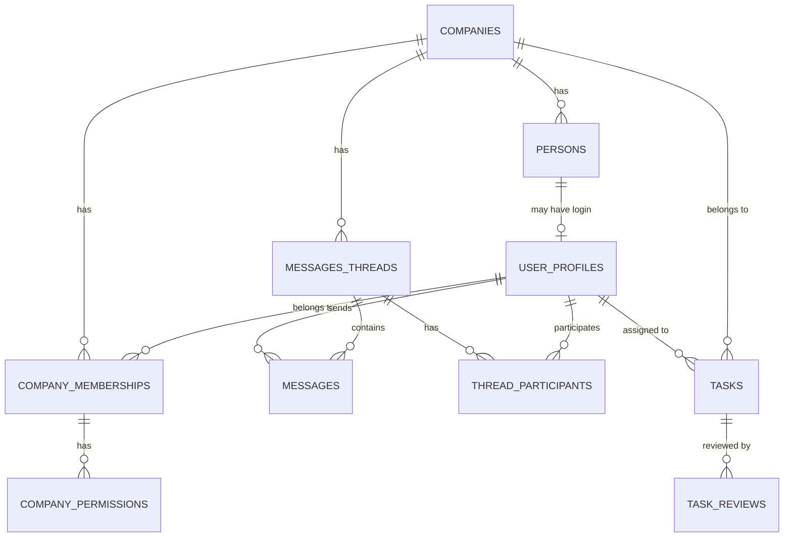
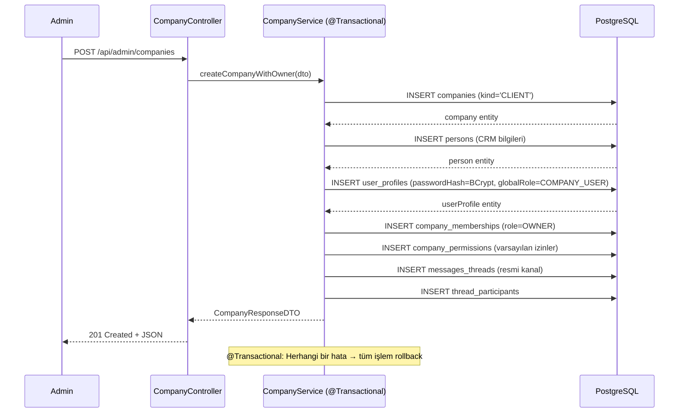

# 🏢 FOG İstanbul — Ajans CRM Projesi: Sıfırdan Kapsamlı Plan

> Bu doküman, `konusma.md` dosyasındaki tüm gereksinimleri, önceki hataların kök neden analizlerini ve sıfırdan doğru bir şekilde nasıl inşa edileceğinin detaylı planını içerir.
> **Revizyon:** Backend → Spring Boot (Java 17), Veritabanı → PostgreSQL, Frontend → React (Vite)

---

## 📋 İçindekiler

1. [Proje Özeti](#1-proje-özeti)
2. [Önceki Hataların Analizi & Çözüm Stratejileri](#2-önceki-hataların-analizi)
3. [Teknoloji Yığını](#3-teknoloji-yığını)
4. [Proje Yapısı (Monorepo)](#4-proje-yapısı)
5. [Veri Modeli (Database Schema)](#5-veri-modeli)
6. [Kullanıcı & Rol Sistemi](#6-kullanıcı--rol-sistemi)
7. [İzin (Permission) Sistemi](#7-izin-permission-sistemi)
8. [Mesajlaşma Mimarisi](#8-mesajlaşma-mimarisi)
9. [Panel Yapıları (Sayfa & Modül Detayları)](#9-panel-yapıları)
10. [API Endpoint Tasarımı](#10-api-endpoint-tasarımı)
11. [Faz Bazlı Uygulama Planı](#11-faz-bazlı-uygulama-planı)
12. [Doğrulama & Test Planı](#12-doğrulama--test-planı)

---

## 1. Proje Özeti

**Amaç:** FOG İstanbul dijital ajansının müşterilerini ve çalışanlarını tek bir panelde yönetmesini sağlayan bir CRM sistemi.

**Üç Ana Panel:**

| Panel | Kullanıcı | Açıklama |
|-------|-----------|----------|
| **Admin** | Ajans sahibi (sen) | Tüm sistemi yönetir: şirket ekle/çıkar, çalışan ekle/çıkar, yetki ata, herşeyi görebilir |
| **Staff** | Ajans çalışanları | Atandıkları şirketlerin görevlerini, mesajlarını, takvimini görür |
| **Client** | Müşteri firma çalışanları | Kendi firmasının raporlarını, görevlerini, mesajlarını görür |

---

## 2. Önceki Hataların Analizi

Önceki geliştirmede karşılaşılan sorunlar ve bu planda nasıl önleneceği:

### 🔴 Hata 1: RLS Sonsuz Döngüsü (Infinite Recursion)

```
Sorun: RLS politikaları → tablo sorgusu → aynı RLS tetiklenir → döngü
Kök Neden: RLS politikası içinde aynı tabloya SELECT yapılması
```

**Bu Plandaki Çözüm:**
- RLS tamamen kaldırıldı. Yetki kontrolü **Spring Security** katmanında yapılacak
- `@PreAuthorize` annotation'ları ve custom `PermissionEvaluator` ile method-level security
- Veritabanı seviyesinde yetki karışıklığı riski sıfır

### 🔴 Hata 2: Kayıp Kullanıcı Profilleri

```
Sorun: auth.users'a kayıt düşüyor ama user_profiles'a düşmüyor
Kök Neden: İki ayrı insert işlemi, birinin başarısız olması
```

**Bu Plandaki Çözüm:**
- Kullanıcı oluşturma tek bir `@Transactional` service metodu içinde
- Spring'in transaction management'ı ile hata olursa otomatik rollback
- Tüm kullanıcı oluşturma admin API'sinden yapılacak (self-registration yok)

### 🔴 Hata 3: Mesajlarda Gönderen İsmi Gözükmüyor

```
Sorun: messages.sender_id → auth.users (erişilemez) referansı
Kök Neden: FK yanlış tabloya bağlı
```

**Bu Plandaki Çözüm:**
- `Message.sender` → `UserProfile` entity'sine `@ManyToOne` JPA ilişkisi
- JPA join'ler ile otomatik eager/lazy loading
- DTO'larda sender bilgisi her zaman mevcut

### 🔴 Hata 4: Rol/Kimlik Karışıklığı

```
Sorun: "ajans çalışanı" mı "müşteri çalışanı" mı belli olmuyor
Kök Neden: Tek bir "role" alanı yetersiz kalıyor
```

**Bu Plandaki Çözüm:**
- `globalRole`: Sistemdeki genel rolü (ADMIN / AGENCY_STAFF / COMPANY_USER) — Java enum
- `membershipRole`: Şirket içindeki rolü (OWNER / EMPLOYEE / AGENCY_STAFF) — Java enum
- İki katmanlı rol sistemi, type-safe enum'larla karışıklık imkansız

---

## 3. Teknoloji Yığını

### Backend

| Katman | Teknoloji | Neden |
|--------|-----------|-------|
| **Framework** | Spring Boot 3.x (Java 17) | Production-grade, güçlü ekosistem |
| **ORM** | Spring Data JPA (Hibernate) | Entity mapping, repository pattern |
| **Veritabanı** | PostgreSQL 16 | Güçlü, açık kaynak, JSON desteği |
| **Auth** | Spring Security + JWT | Stateless auth, role-based access |
| **Migration** | Flyway | Versiyon kontrollü schema migration |
| **Validation** | Bean Validation (Jakarta) | DTO validation |
| **API Docs** | SpringDoc OpenAPI (Swagger) | Otomatik API dokümantasyonu |
| **WebSocket** | Spring WebSocket + STOMP | Real-time mesajlaşma |
| **File Storage** | Cloudinary | Logo, profil fotoğrafı, medya dosyaları (CDN + otomatik optimizasyon) |
| **Build** | Maven | Dependency management |

### Frontend

| Katman | Teknoloji | Neden |
|--------|-----------|-------|
| **Framework** | React 19 (Vite) | Hızlı build, modern DX |
| **Stil** | Tailwind CSS v4 + shadcn/ui | Hızlı, tutarlı, erişilebilir UI |
| **State** | TanStack Query (React Query) | Server state yönetimi, cache |
| **Routing** | React Router v7 | SPA routing |
| **Form** | React Hook Form + Zod | Validation + type safety |
| **Takvim** | FullCalendar | Görev/toplantı takvimi |
| **Grafikler** | Recharts | Dashboard grafikleri |
| **Dil** | TypeScript | Tip güvenliği |
| **WebSocket** | SockJS + @stomp/stompjs | Real-time mesajlaşma client |

---

## 4. Proje Yapısı

```
ajans-crm/
├── backend/                          # Spring Boot uygulaması
│   ├── src/main/java/com/fogistanbul/crm/
│   │   ├── config/                   # SecurityConfig, WebSocketConfig, CorsConfig
│   │   ├── controller/               # REST controller'lar
│   │   ├── dto/                      # Request/Response DTO'lar
│   │   ├── entity/                   # JPA entity'leri
│   │   │   ├── enums/                # GlobalRole, MembershipRole, TaskStatus vb.
│   │   ├── exception/                # Custom exception'lar + GlobalExceptionHandler
│   │   ├── repository/               # Spring Data JPA repository'leri
│   │   ├── security/                 # JwtTokenProvider, JwtAuthFilter, PermissionEvaluator
│   │   ├── service/                  # Business logic
│   │   └── CrmApplication.java
│   ├── src/main/resources/
│   │   ├── application.yml           # DB config, JWT secret, CORS
│   │   └── db/migration/             # Flyway migration SQL dosyaları
│   └── pom.xml
│
├── frontend/                         # React (Vite) uygulaması
│   ├── src/
│   │   ├── api/                      # Axios instance, API fonksiyonları
│   │   ├── components/               # Paylaşılan UI bileşenleri
│   │   ├── hooks/                    # Custom hooks (useAuth, usePermission)
│   │   ├── layouts/                  # AdminLayout, StaffLayout, ClientLayout
│   │   ├── pages/                    # Sayfa bileşenleri
│   │   │   ├── admin/
│   │   │   ├── staff/
│   │   │   ├── client/
│   │   │   └── auth/
│   │   ├── store/                    # Auth context/store
│   │   ├── types/                    # TypeScript tipleri
│   │   └── utils/                    # Yardımcı fonksiyonlar
│   ├── index.html
│   └── package.json
│
├── docker-compose.yml                # PostgreSQL + MinIO (dev ortamı)
└── proje-plani.md
```

---

## 5. Veri Modeli

### 5.1 Entity-Relationship Diyagramı



### 5.2 Flyway Migration Stratejisi

Migration dosyaları `V{versiyon}__{açıklama}.sql` formatında olacak:

```
db/migration/
├── V1__create_companies_table.sql
├── V2__create_persons_table.sql
├── V3__create_user_profiles_table.sql
├── V4__create_company_memberships_table.sql
├── V5__create_permission_definitions_and_company_permissions.sql
├── V6__create_messaging_tables.sql
├── V7__create_tasks_tables.sql
├── V8__create_meetings_tables.sql
├── V9__create_shoots_tables.sql
├── V10__create_pr_projects_tables.sql
├── V11__create_notes_and_surveys.sql
├── V12__seed_permission_definitions.sql
├── V13__seed_agency_company.sql
└── V14__create_indexes.sql
```

### 5.3 Tablo Detayları

> Tüm tablolar JPA entity olarak modellenecek. Aşağıda veritabanı şeması gösterilmektedir.

---

#### `companies` — Şirketler

```java
@Entity
@Table(name = "companies")
public class Company {
    @Id @GeneratedValue(strategy = GenerationType.UUID)
    private UUID id;
    
    @Enumerated(EnumType.STRING)
    @Column(nullable = false)
    private CompanyKind kind; // AGENCY, CLIENT
    
    @Column(nullable = false)
    private String name;
    
    private String industry;
    private String taxId;
    private Integer foundedYear;
    private String vision;
    private String mission;
    private Integer employeeCount;
    private String email;
    private String phone;
    private String address;
    private String website;
    private String socialInstagram;
    private String socialFacebook;
    private String socialTwitter;
    private String socialLinkedin;
    private String socialYoutube;
    private String socialTiktok;
    private String logoUrl;
    private String notes;
    
    @Enumerated(EnumType.STRING)
    private ContractStatus contractStatus; // ACTIVE, INACTIVE, PENDING
    
    @CreationTimestamp
    private Instant createdAt;
    @UpdateTimestamp
    private Instant updatedAt;
}
```

> [!IMPORTANT]
> Sistem başlatılırken `kind = AGENCY` olarak **FOG İstanbul** şirketi `V13` migration ile otomatik oluşturulacak.

---

#### `persons` — Kişiler (CRM)

| Kolon | Tip | Açıklama |
|-------|-----|----------|
| `id` | UUID, PK | Otomatik |
| `company_id` | UUID, FK → companies | Birincil şirketi |
| `full_name` | VARCHAR, NOT NULL | Ad soyad |
| `email` | VARCHAR | E-posta |
| `phone` | VARCHAR | Telefon |
| `position_title` | VARCHAR | Pozisyon/ünvan |
| `department` | VARCHAR | Departman |
| `address` | TEXT | Adres |
| `birth_date` | DATE | Doğum tarihi |
| `likes` | TEXT | Sevdikleri |
| `dislikes` | TEXT | Sevmedikleri |
| `notes` | TEXT | Ajans için faydalı notlar |
| `avatar_url` | VARCHAR | Profil fotoğrafı |
| `created_at` | TIMESTAMP | |
| `updated_at` | TIMESTAMP | |

---

#### `user_profiles` — Giriş Yapan Kullanıcılar

| Kolon | Tip | Açıklama |
|-------|-----|----------|
| `id` | UUID, PK | Otomatik üretilir |
| `person_id` | UUID, FK → persons, UNIQUE | CRM kaydına bağlantı |
| `global_role` | VARCHAR, NOT NULL | `ADMIN` / `AGENCY_STAFF` / `COMPANY_USER` (Java Enum) |
| `email` | VARCHAR, UNIQUE, NOT NULL | Login email |
| `password_hash` | VARCHAR, NOT NULL | BCrypt ile hashlenmiş şifre |
| `created_at` | TIMESTAMP | |
| `updated_at` | TIMESTAMP | |

> [!TIP]
> `person_id` bağlantısı sayesinde kullanıcının tüm kişisel bilgileri tek yerden (`persons`) yönetilir. `user_profiles` sadece auth, credential ve rol bilgisini taşır.

---

#### `company_memberships` — Kullanıcı ↔ Şirket Bağlantısı

| Kolon | Tip | Açıklama |
|-------|-----|----------|
| `id` | UUID, PK | |
| `user_id` | UUID, FK → user_profiles | |
| `company_id` | UUID, FK → companies | |
| `membership_role` | VARCHAR | `OWNER` / `EMPLOYEE` / `AGENCY_STAFF` |
| `created_at` | TIMESTAMP | |

**UNIQUE constraint:** `(user_id, company_id)`

---

#### `permission_definitions` — İzin Tanımları (Seed Data)

| Kolon | Tip | Açıklama |
|-------|-----|----------|
| `key` | VARCHAR, PK | Benzersiz izin anahtarı |
| `label` | VARCHAR | Görüntüleme ismi |
| `description` | TEXT | Açıklama |
| `category` | VARCHAR | Gruplama |

**Seed İzinler:**

| Key | Label | Kategori |
|-----|-------|----------|
| `messages.general.write` | Genel kanalda mesaj yazma | messages |
| `messages.dm.start` | Özel mesaj başlatma | messages |
| `messages.dm.write` | Özel mesajda yazma | messages |
| `tasks.view` | Görevleri görme | tasks |
| `tasks.create` | Görev oluşturma | tasks |
| `tasks.update` | Görev güncelleme | tasks |
| `calendar.view` | Takvimi görme | calendar |
| `calendar.create` | Etkinlik oluşturma | calendar |
| `meetings.request` | Toplantı talebi | meetings |
| `reports.view` | Raporları görme | reports |
| `pr.view` | PR projelerini görme | pr |
| `pr.create` | PR projesi oluşturma | pr |
| `shoots.view` | Çekimleri görme | shoots |
| `shoots.create` | Çekim planlama | shoots |
| `panel.dashboard` | Dashboard erişimi | panel |
| `panel.companies` | Şirketler erişimi | panel |
| `panel.completed_tasks` | Tamamlanan işler erişimi | panel |

---

#### `company_permissions` — Kullanıcı İzinleri (Şirket Bazlı)

| Kolon | Tip | Açıklama |
|-------|-----|----------|
| `id` | UUID, PK | |
| `user_id` | UUID, FK → user_profiles | |
| `company_id` | UUID, FK → companies | |
| `permission_key` | VARCHAR, FK → permission_definitions | |
| `level` | VARCHAR | `NONE` / `RESTRICTED` / `FULL` |
| `created_at` | TIMESTAMP | |

**UNIQUE constraint:** `(user_id, company_id, permission_key)`

---

#### Mesajlaşma Tabloları

**`messages_threads`** — Mesaj Kanalları

| Kolon | Tip | Açıklama |
|-------|-----|----------|
| `id` | UUID, PK | |
| `thread_type` | VARCHAR | `COMPANY_GROUP` / `DIRECT_MESSAGE` |
| `company_id` | UUID, FK → companies, NULL | Şirket grubu ise dolu |
| `subject` | VARCHAR | Konu başlığı |
| `is_official_channel` | BOOLEAN | Resmi kanal mı? |
| `created_by` | UUID, FK → user_profiles | |
| `created_at` | TIMESTAMP | |
| `updated_at` | TIMESTAMP | |

**`thread_participants`** — Kanal Katılımcıları

| Kolon | Tip | Açıklama |
|-------|-----|----------|
| `id` | UUID, PK | |
| `thread_id` | UUID, FK → messages_threads | |
| `user_id` | UUID, FK → user_profiles | |
| `is_active` | BOOLEAN, DEFAULT true | false = opt-out |
| `joined_at` | TIMESTAMP | |

**`messages`** — Mesajlar

| Kolon | Tip | Açıklama |
|-------|-----|----------|
| `id` | UUID, PK | |
| `thread_id` | UUID, FK → messages_threads | |
| `sender_id` | UUID, FK → **user_profiles** | ⚠️ Önceki hatanın çözümü |
| `content` | TEXT | Mesaj içeriği |
| `is_approval_pending` | BOOLEAN, DEFAULT false | |
| `created_at` | TIMESTAMP | |

**`message_read_receipts`** — Okundu Bilgisi

| Kolon | Tip | Açıklama |
|-------|-----|----------|
| `id` | UUID, PK | |
| `message_id` | UUID, FK → messages | |
| `user_id` | UUID, FK → user_profiles | |
| `read_at` | TIMESTAMP | |

---

#### Diğer Tablolar

Aşağıdaki tablolar önceki planla aynı yapıda, JPA entity olarak modellenecek:

- **`approval_requests`** — Onay Talepleri
- **`tasks`** — Görevler (category, priority, status enum'ları ile)
- **`task_reviews`** — Görev Puanlaması
- **`meetings`** — Toplantılar
- **`meeting_participants`** — Toplantı Katılımcıları
- **`shoots`** — Çekimler
- **`shoot_participants`** — Çekim Ekibi
- **`pr_projects`** — PR Projeleri
- **`pr_project_phases`** — PR Proje Aşamaları
- **`pr_project_members`** — PR Proje Ekibi
- **`notes`** — Notlar
- **`satisfaction_surveys`** — Memnuniyet Anketleri

> Tüm tablo şemaları önceki planla birebir aynı. UUID PK, TIMESTAMP tarih alanları, FK ilişkileri korunuyor.

---

## 6. Kullanıcı & Rol Sistemi

### 6.1 İki Katmanlı Rol Yapısı

```java
// Global roller — user_profiles tablosunda
public enum GlobalRole {
    ADMIN,          // Sistem yöneticisi (sen)
    AGENCY_STAFF,   // FOG İstanbul çalışanı
    COMPANY_USER    // Müşteri firma kullanıcısı
}

// Membership roller — company_memberships tablosunda
public enum MembershipRole {
    OWNER,          // Firma sahibi
    EMPLOYEE,       // Firma çalışanı
    AGENCY_STAFF    // Firmaya atanmış ajans çalışanı
}
```

### 6.2 Spring Security Yapılandırması

```java
@Configuration
@EnableWebSecurity
@EnableMethodSecurity(prePostEnabled = true)
public class SecurityConfig {

    @Bean
    public SecurityFilterChain filterChain(HttpSecurity http) {
        return http
            .csrf(csrf -> csrf.disable())
            .sessionManagement(sm -> sm.sessionCreationPolicy(STATELESS))
            .authorizeHttpRequests(auth -> auth
                .requestMatchers("/api/auth/**").permitAll()
                .requestMatchers("/api/admin/**").hasRole("ADMIN")
                .requestMatchers("/api/staff/**").hasAnyRole("ADMIN", "AGENCY_STAFF")
                .requestMatchers("/api/client/**").hasAnyRole("ADMIN", "COMPANY_USER")
                .anyRequest().authenticated()
            )
            .addFilterBefore(jwtAuthFilter, UsernamePasswordAuthenticationFilter.class)
            .build();
    }
}
```

### 6.3 JWT Token Yapısı

```json
{
  "sub": "user-uuid",
  "email": "user@example.com",
  "globalRole": "AGENCY_STAFF",
  "iat": 1700000000,
  "exp": 1700086400
}
```

- Access Token: 24 saat
- Refresh Token: 7 gün (veritabanında saklanır)

### 6.4 Kullanıcı Oluşturma Akışı



---

## 7. İzin (Permission) Sistemi

### 7.1 Üç Seviyeli İzin Modeli

| Seviye | Enum | Davranış |
|--------|------|----------|
| **Yetki Yok** | `NONE` | Hiçbir işlem yapamaz |
| **Kısıtlı** | `RESTRICTED` | İşlem yapabilir ama onay gerekir |
| **Tam Yetki** | `FULL` | Direkt işlem yapabilir |

### 7.2 Custom PermissionEvaluator

```java
@Component
public class CrmPermissionEvaluator {
    
    public PermissionLevel checkPermission(UUID userId, UUID companyId, String permissionKey) {
        // 1. Admin → her zaman FULL
        UserProfile user = userProfileRepository.findById(userId).orElseThrow();
        if (user.getGlobalRole() == GlobalRole.ADMIN) return PermissionLevel.FULL;
        
        // 2. Membership kontrolü
        CompanyMembership membership = membershipRepository
            .findByUserIdAndCompanyId(userId, companyId)
            .orElseThrow(() -> new AccessDeniedException("Bu şirkete erişiminiz yok"));
        
        // 3. Permission kontrolü
        return companyPermissionRepository
            .findByUserIdAndCompanyIdAndPermissionKey(userId, companyId, permissionKey)
            .map(CompanyPermission::getLevel)
            .orElse(PermissionLevel.NONE);
    }
}
```

### 7.3 Varsayılan İzinler

| Kullanıcı Tipi | Varsayılan |
|-----------------|-----------|
| Şirket Sahibi (OWNER) | Tüm izinler `FULL` |
| Şirket Çalışanı (EMPLOYEE) | `messages.general.write: FULL`, `tasks.view: FULL` — geri kalanı admin ayarlar |
| Ajans Çalışanı (AGENCY_STAFF) | Admin her şirket için ayrı ayrı ayarlar |

---

## 8. Mesajlaşma Mimarisi

### 8.1 WebSocket Yapılandırması (Spring STOMP)

```java
@Configuration
@EnableWebSocketMessageBroker
public class WebSocketConfig implements WebSocketMessageBrokerConfigurer {
    
    @Override
    public void configureMessageBroker(MessageBrokerRegistry config) {
        config.enableSimpleBroker("/topic", "/queue");
        config.setApplicationDestinationPrefixes("/app");
        config.setUserDestinationPrefix("/user");
    }
    
    @Override
    public void registerStompEndpoints(StompEndpointRegistry registry) {
        registry.addEndpoint("/ws")
            .setAllowedOriginPatterns("*")
            .withSockJS();
    }
}
```

### 8.2 Kanal Türleri

| Tür | Açıklama | Oluşturma |
|-----|----------|-----------|
| **Resmi Şirket Kanalı** | Şirketin genel chati | Şirket oluşturulunca **Service katmanında otomatik** |
| **Özel Mesaj (DM)** | İki kişi arası özel sohbet | Kullanıcı başlatır (izni varsa) |

### 8.3 Mesaj Gönderme Akışı

```
Kullanıcı mesaj gönderir → MessageController
    ↓
1. JWT'den userId çıkar
2. ThreadParticipant kontrolü (aktif mi?)
    ↓ (evet)
3. Permission kontrolü (CrmPermissionEvaluator)
    ↓
   FULL       → Message kaydedilir → WebSocket ile broadcast
   RESTRICTED → ApprovalRequest oluşturulur → Sahibine bildirim
   NONE       → 403 Forbidden
```

### 8.4 WebSocket Topic'leri

```
/topic/thread/{threadId}     → Kanal mesajları (yeni mesaj broadcast)
/user/{userId}/queue/notifications → Kişisel bildirimler
/user/{userId}/queue/approvals    → Onay talepleri
```

---

## 9. Panel Yapıları

### 9.1 Admin Paneli Sayfaları

| Sayfa | Route | İçerik |
|-------|-------|--------|
| Dashboard | `/admin` | Genel istatistikler |
| Şirketler | `/admin/companies` | Şirket listesi, yeni şirket oluştur |
| Şirket Detay | `/admin/companies/:id` | Bilgiler, çalışanlar, izinler, notlar |
| Ajans Çalışanları | `/admin/staff` | Çalışan listesi, yeni çalışan ekle |
| Çalışan Detay | `/admin/staff/:id` | Bilgiler, atandığı şirketler, izinler |
| Mesajlar | `/admin/messages` | Tüm mesaj kanalları |
| Ayarlar | `/admin/settings` | Sistem ayarları |

### 9.2 Staff Paneli Sayfaları

| Sayfa | Route | İçerik |
|-------|-------|--------|
| Ana Panel | `/staff` | Günlük görev listesi, mesaj özeti, notlar |
| Takvim | `/staff/calendar` | Aylık takvim |
| Görevler | `/staff/tasks` | Tüm görevler, filtreler |
| Şirketler | `/staff/companies` | Atandığı şirketler |
| Şirket Detay | `/staff/companies/:id` | Şirket bilgileri, çalışanları |
| Tamamlanan İşler | `/staff/completed` | Biten görevler, puanlar |
| PR Projeleri | `/staff/pr` | PR projeleri |
| Çekimler | `/staff/shoots` | Çekim planları |
| Mesajlar | `/staff/messages` | Companies + Direct tablar |

### 9.3 Client Paneli Sayfaları

| Sayfa | Route | İçerik |
|-------|-------|--------|
| Raporlar | `/client` | Placeholder raporlar (Faz 6'da API entegrasyonu) |
| Medya Kütüphanesi | `/client/media` | Paylaşılan görseller/videolar |
| Yapılacak Görevler | `/client/tasks` | Bekleyen görevler |
| Yapılan Görevler | `/client/completed` | Tamamlanan + puanlama |
| Ek Hizmet Al | `/client/services` | Ek hizmet talep formu |
| Ayarlar | `/client/settings` | Profil ayarları |
| Mesajlar | `/client/messages` | Genel kanal + DM |

---

## 10. API Endpoint Tasarımı

### Auth API

| Method | Endpoint | İşlev |
|--------|----------|-------|
| POST | `/api/auth/login` | Email + password → JWT token döner |
| POST | `/api/auth/refresh` | Refresh token → yeni access token |
| POST | `/api/auth/logout` | Refresh token'ı invalidate et |
| GET | `/api/auth/me` | Mevcut kullanıcı bilgisi |

### Admin API

| Method | Endpoint | İşlev |
|--------|----------|-------|
| POST | `/api/admin/companies` | Şirket + sahibi oluştur |
| GET | `/api/admin/companies` | Tüm şirketleri listele |
| GET | `/api/admin/companies/{id}` | Şirket detay |
| PUT | `/api/admin/companies/{id}` | Şirket güncelle |
| POST | `/api/admin/companies/{id}/employees` | Şirkete çalışan ekle |
| POST | `/api/admin/staff` | Ajans çalışanı oluştur |
| GET | `/api/admin/staff` | Ajans çalışanlarını listele |
| POST | `/api/admin/staff/{id}/assign` | Çalışanı şirkete ata |
| PUT | `/api/admin/permissions` | İzin seviyesi güncelle |
| DELETE | `/api/admin/memberships/{id}` | Üyelik kaldır |

### Mesajlaşma API

| Method | Endpoint | İşlev |
|--------|----------|-------|
| GET | `/api/messages/threads` | Kullanıcının kanallarını getir |
| GET | `/api/messages/threads/{id}` | Kanal mesajlarını getir (paginated) |
| POST | `/api/messages/send` | Mesaj gönder (izin kontrolü) |
| POST | `/api/messages/dm` | Yeni DM başlat |
| PUT | `/api/messages/approve/{id}` | Onay talebi onayla/reddet |
| PUT | `/api/messages/read/{threadId}` | Okundu işaretle |
| PUT | `/api/messages/opt-out/{threadId}` | Kanaldan çık |

### Görev API

| Method | Endpoint | İşlev |
|--------|----------|-------|
| GET | `/api/tasks` | Görevleri filtreli getir (paginated) |
| POST | `/api/tasks` | Görev oluştur |
| PUT | `/api/tasks/{id}` | Görev güncelle |
| POST | `/api/tasks/{id}/review` | Görev puanla (müşteri) |

### Diğer API'lar

| Method | Endpoint | İşlev |
|--------|----------|-------|
| CRUD | `/api/meetings/**` | Toplantı yönetimi |
| CRUD | `/api/shoots/**` | Çekim yönetimi |
| CRUD | `/api/pr-projects/**` | PR proje yönetimi |
| CRUD | `/api/notes/**` | Not yönetimi |
| POST | `/api/surveys` | Memnuniyet anketi gönder |

---

## 11. Faz Bazlı Uygulama Planı

### Faz 1: Temel Altyapı (Tamamlandı ✅)

**Backend:**
- [x] Spring Boot projesi oluşturma (Spring Initializr: Web, JPA, Security, WebSocket, Validation)
- [x] PostgreSQL + docker-compose.yml kurulumu
- [x] application.yml yapılandırması (DB, JWT secret, CORS)
- [x] Flyway migration dosyaları (tüm tablolar, FK, indexler)
- [x] JPA Entity'leri ve Repository'leri
- [x] Spring Security + JWT yapılandırması (JwtTokenProvider, JwtAuthFilter)
- [x] GlobalExceptionHandler
- [x] Auth API (login, refresh, logout, me)

**Frontend:**
- [x] React (Vite) proje kurulumu (TypeScript, Tailwind v4, shadcn/ui)
- [x] Axios instance + interceptor (JWT token ekleme, 401 redirect)
- [x] Auth context/store
- [x] Login sayfası
- [x] Layout yapıları: AdminLayout, StaffLayout, ClientLayout (sidebar'lar)
- [x] Protected route wrapper (rol bazlı yönlendirme)

### Faz 2: Admin Paneli + Kullanıcı Yönetimi (Tamamlandı ✅)
- [x] Admin Dashboard (istatistikler)
- [x] Şirket oluşturma (geniş form + sahip)
- [x] Şirket detay sayfası (çalışanlar, izinler, kanal yönetimi)
- [x] Ajans çalışanı oluşturma
- [x] Çalışan detay (atama, izin yönetimi)
- [x] Admin API endpoint'leri (CompanyController, StaffController, PermissionController)

### Faz 3: Staff Paneli (Tamamlandı ✅)
- [x] Staff Ana Panel (günlük görev tablosu, mesaj özeti, notlar)
- [x] Takvim sayfası (custom calendar grid + görev entegrasyonu)
- [x] Görevler sayfası (filtreler, pagination)
- [x] Şirketler sayfası
- [x] Tamamlanan İşler
- [x] PR Projeleri
- [x] Çekimler
- [x] Floating Action Button (tüm dialog'lar)

### Faz 4: Mesajlaşma Sistemi (Tamamlandı ✅)
- [x] WebSocket yapılandırması (STOMP + SockJS + JWT auth)
- [x] Staff Mesajlar sayfası (thread listesi + chat arayüzü)
- [x] Client Mesajlar sayfası
- [x] Mesaj gönderme (izin kontrolü ile)
- [x] Onay talebi sistemi (restricted)
- [x] Okundu bilgisi — DM'lerde `isRead` + ✓✓ ikonları implemente edildi (`MessagingPage.tsx` L504-506, `handleReadReceipt` callback)
- [ ] Opt-out mekanizması — Faz 6'da eklenecek
- [x] Real-time broadcast (WebSocket STOMP)
- [x] Grup mesajlaşma (şirket bazlı otomatik grup kanalları) — `GroupConversation`, `GroupMessagingService`, `GroupMessagingController`
- [x] Grup mesajlarında ajans vs şirket çalışanı renk ayrımı — `senderGlobalRole === 'AGENCY_STAFF'` kontrolüyle turuncu renk + "Ajans" badge (`MessagingPage.tsx` L407-412)

### Faz 5: Client Paneli (Tamamlandı ✅)
- [x] Client Raporlar sayfası (placeholder veriler ile)
- [x] Medya Kütüphanesi
- [x] Görev görüntüleme + puanlama
- [x] Ek Hizmet Al
- [x] Genel Ayarlar
- [x] Client Mesajlaşma
- [x] Client Layout (mavi tema)

### Faz 6: Entegrasyonlar & Polish (Tamamlandı ✅)
- [x] Google Analytics API entegrasyonu — `GoogleAnalyticsController`, `GoogleAnalyticsService`, `GoogleAnalyticsDetailPage.tsx`
- [x] Google Search Console API entegrasyonu — `SearchConsoleController`, `SearchConsoleService`, `SearchConsoleDetailPage.tsx`
- [x] Instagram API entegrasyonu — `InstagramController`, `InstagramService`, `InstagramOAuthController`, `InstagramDetailPage.tsx`
- [x] Google Ads API entegrasyonu — `GoogleAdsController`, `GoogleAdsService`, `GoogleAdsDetailPage.tsx`
- [x] Meta Ads API entegrasyonu — `MetaAdsController`, `MetaAdsService`, `MetaAdsDetailPage.tsx` (plana sonradan eklendi)
- [x] PageSpeed entegrasyonu — `PageSpeedController`, `PageSpeedService`, `PageSpeedDetailPage.tsx` (plana sonradan eklendi)
- [ ] WP Form / Webhook entegrasyonu — Henüz yapılmadı
- [x] Memnuniyet anketi sistemi — `SurveyPage.tsx`, `SurveyService`, `ClientSurveyController`, backend entity ve API tam çalışıyor
- [x] Bildirim sistemi (WebSocket-based) — `NotificationBell.tsx`, `NotificationService`, `NotificationController`, tüm bildirim tipleri tanımlı
- [ ] Responsive tasarım optimizasyonu — Kısmen yapıldı, tam optimizasyon bekliyor
- [ ] Performance optimizasyonu — Bekliyor

### Faz 6 Ek Özellikler (Plana Sonradan Eklendi ✅)
- [x] Kanban Board — `KanbanPage.tsx` (45KB), `KanbanBoard.tsx`
- [x] Hızlı Arama — `GlobalSearch.tsx`, `SearchController`, `SearchService`
- [x] Dark Mode — `ThemeToggle.tsx`
- [x] Dosya/Medya Yükleme — `FileController`, `FileService` (Cloudinary entegrasyonu)
- [x] Aktivite Geçmişi — `ActivityLogController`, `ActivityLogService`, `ActivityLogPage.tsx`
- [x] Zaman Takibi — `TimeTrackingController`, `TimeTrackingService`, `TimeTrackingPage.tsx`
- [x] İçerik Planı — `ContentPlanService`, `StaffContentPlanController`, `ClientContentPlanPage.tsx`
- [x] Rutin Görev Yönetimi — `RoutineTaskService`, `AdminRoutineController`, `RoutineManagementPage.tsx`
- [x] Email Bildirimleri — `EmailService`
- [x] Çoklu Dil Desteği (i18n) — `i18n` klasörü, `LanguageSwitcher.tsx`
- [x] Admin Kullanıcı Yönetimi — `UsersPage.tsx`, `UserManagementController`
- [x] Admin Analitik Özet — `AdminAnalyticsPage.tsx`, `StaffAnalyticsPage.tsx`
- [x] Google OAuth — `OAuthController`, `GoogleOAuthService`, `InstagramOAuthService`
- [x] Web Bakım Log — `MaintenanceLogController`, `MaintenanceLogService`

---

## 12. Doğrulama & Test Planı

### Otomatik Testler

| Test Türü | Araç | Kapsam |
|-----------|------|--------|
| **Unit Test** | JUnit 5 + Mockito | Service katmanı, PermissionEvaluator, utility'ler |
| **Integration Test** | Spring Boot Test + TestContainers (PostgreSQL) | Repository, Controller, tam akış testleri |
| **API Test** | MockMvc / WebTestClient | Her endpoint: happy path + error case |
| **Frontend Unit** | Vitest + Testing Library | Component render, hook testleri |
| **E2E Test** | Playwright | Kritik akışlar (login, şirket oluştur, mesaj gönder) |

### Manuel Test Senaryoları

1. **Kullanıcı Oluşturma Testi:**
   - Admin ile login → Şirket oluştur (tüm bilgilerle) → Şirket sahibi ile login → Panel açılmalı
   - Şirkete çalışan ekle → Çalışan ile login → Sadece yetkili bölümleri görmeli

2. **Mesajlaşma Testi:**
   - Şirket oluşturulunca resmi kanal otomatik oluşmalı
   - Yeni çalışan eklendi → Kanala otomatik eklenmeli
   - Opt-out → Çalışan kanalı görmemeli
   - Restricted permission → Onay talebi oluşmalı

3. **İzin Testi:**
   - `NONE` izinli kullanıcı → 403 Forbidden almalı
   - `RESTRICTED` izinli kullanıcı → İşlem yapabilmeli ama onay beklemeli
   - `FULL` izinli kullanıcı → Direkt işlem yapabilmeli

4. **WebSocket Testi:**
   - İki farklı tarayıcıda aynı kanala bağlan → Mesaj anlık görülmeli
   - Bağlantı kopunca otomatik reconnect

---

## Geliştirme Ortamı Kurulumu

### docker-compose.yml

```yaml
version: '3.8'
services:
  postgres:
    image: postgres:16-alpine
    environment:
      POSTGRES_DB: ajans_crm
      POSTGRES_USER: crm_user
      POSTGRES_PASSWORD: crm_password
    ports:
      - "5432:5432"
    volumes:
      - pgdata:/var/lib/postgresql/data

volumes:
  pgdata:
```

> **File Storage:** Cloudinary kullanılacak. `CLOUDINARY_URL` environment variable olarak `application.yml`'de tanımlanacak.

### Backend Çalıştırma

```bash
cd backend
./mvnw spring-boot:run
# Sunucu: http://localhost:8080
# Swagger UI: http://localhost:8080/swagger-ui.html
```

### Frontend Çalıştırma

```bash
cd frontend
npm install
npm run dev
# Sunucu: http://localhost:5173
```

---

## User Review Required

> [!IMPORTANT]
> Bu plan projeyi **sıfırdan** kurmayı öngörüyor. Backend tamamen Spring Boot, veritabanı PostgreSQL olacak.

> [!WARNING]
> Harici API entegrasyonları (Google Analytics, Instagram vb.) API anahtarları ve OAuth kurulumu gerektirecek. Bu bilgileri Faz 6'da senden isteyeceğim.

**Karar verilmesi gerekenler:**

1. **Java versiyonu:** Java 21 (LTS) önerildi. Uygun mu?
2. **Domain/Deploy:** Proje şimdilik sadece localhost mu yoksa deploy da yapılacak mı? (Docker Compose ile production deploy de yapılabilir)
3. **Dil:** UI tamamen Türkçe mi olacak yoksa İngilizce mi?
4. ~~**File Storage:**~~ ✅ **Cloudinary** kullanılacak (onaylandı)
5. **Fazlara onay:** Yukarıdaki faz sıralaması uygun mu? Değiştirmek istediğin bir öncelik var mı?
